# Projects and dependencies analysis

This document provides a comprehensive overview of the projects and their dependencies in the context of upgrading to .NETCoreApp,Version=v10.0.

## Table of Contents

- [Executive Summary](#executive-Summary)
  - [Highlevel Metrics](#highlevel-metrics)
  - [Projects Compatibility](#projects-compatibility)
  - [Package Compatibility](#package-compatibility)
  - [API Compatibility](#api-compatibility)
- [Aggregate NuGet packages details](#aggregate-nuget-packages-details)
- [Top API Migration Challenges](#top-api-migration-challenges)
  - [Technologies and Features](#technologies-and-features)
  - [Most Frequent API Issues](#most-frequent-api-issues)
- [Projects Relationship Graph](#projects-relationship-graph)
- [Project Details](#project-details)

  - [src\DocumentNumber.InternationalBankAccountNumber.Validator\DocumentNumber.InternationalBankAccountNumber.Validator.csproj](#srcdocumentnumberinternationalbankaccountnumbervalidatordocumentnumberinternationalbankaccountnumbervalidatorcsproj)
  - [src\DocumentNumber.PaymentCardNumber.AmericanExpress.Generator\DocumentNumber.PaymentCardNumber.AmericanExpress.Generator.csproj](#srcdocumentnumberpaymentcardnumberamericanexpressgeneratordocumentnumberpaymentcardnumberamericanexpressgeneratorcsproj)
  - [src\DocumentNumber.PaymentCardNumber.AmericanExpress.Validator\DocumentNumber.PaymentCardNumber.AmericanExpress.Validator.csproj](#srcdocumentnumberpaymentcardnumberamericanexpressvalidatordocumentnumberpaymentcardnumberamericanexpressvalidatorcsproj)
  - [src\DocumentNumber.PaymentCardNumber.Common\DocumentNumber.PaymentCardNumber.Common.csproj](#srcdocumentnumberpaymentcardnumbercommondocumentnumberpaymentcardnumbercommoncsproj)
  - [src\DocumentNumber.PaymentCardNumber.Generator.Common\DocumentNumber.PaymentCardNumber.Generator.Common.csproj](#srcdocumentnumberpaymentcardnumbergeneratorcommondocumentnumberpaymentcardnumbergeneratorcommoncsproj)
  - [src\DocumentNumber.PaymentCardNumber.Maestro.Generator\DocumentNumber.PaymentCardNumber.Maestro.Generator.csproj](#srcdocumentnumberpaymentcardnumbermaestrogeneratordocumentnumberpaymentcardnumbermaestrogeneratorcsproj)
  - [src\DocumentNumber.PaymentCardNumber.Maestro.Validator\DocumentNumber.PaymentCardNumber.Maestro.Validator.csproj](#srcdocumentnumberpaymentcardnumbermaestrovalidatordocumentnumberpaymentcardnumbermaestrovalidatorcsproj)
  - [src\DocumentNumber.PaymentCardNumber.MaestroUK.Generator\DocumentNumber.PaymentCardNumber.MaestroUK.Generator.csproj](#srcdocumentnumberpaymentcardnumbermaestroukgeneratordocumentnumberpaymentcardnumbermaestroukgeneratorcsproj)
  - [src\DocumentNumber.PaymentCardNumber.MaestroUK.Validator\DocumentNumber.PaymentCardNumber.MaestroUK.Validator.csproj](#srcdocumentnumberpaymentcardnumbermaestroukvalidatordocumentnumberpaymentcardnumbermaestroukvalidatorcsproj)
  - [src\DocumentNumber.PaymentCardNumber.Mastercard.Generator\DocumentNumber.PaymentCardNumber.Mastercard.Generator.csproj](#srcdocumentnumberpaymentcardnumbermastercardgeneratordocumentnumberpaymentcardnumbermastercardgeneratorcsproj)
  - [src\DocumentNumber.PaymentCardNumber.Mastercard.Validator\DocumentNumber.PaymentCardNumber.Mastercard.Validator.csproj](#srcdocumentnumberpaymentcardnumbermastercardvalidatordocumentnumberpaymentcardnumbermastercardvalidatorcsproj)
  - [src\DocumentNumber.PaymentCardNumber.VISA.Generator\DocumentNumber.PaymentCardNumber.VISA.Generator.csproj](#srcdocumentnumberpaymentcardnumbervisageneratordocumentnumberpaymentcardnumbervisageneratorcsproj)
  - [src\DocumentNumber.PaymentCardNumber.VISA.Validator\DocumentNumber.PaymentCardNumber.VISA.Validator.csproj](#srcdocumentnumberpaymentcardnumbervisavalidatordocumentnumberpaymentcardnumbervisavalidatorcsproj)
  - [src\DocumentNumber.PaymentCardNumber.VISAElectron.Generator\DocumentNumber.PaymentCardNumber.VISAElectron.Generator.csproj](#srcdocumentnumberpaymentcardnumbervisaelectrongeneratordocumentnumberpaymentcardnumbervisaelectrongeneratorcsproj)
  - [src\DocumentNumber.PaymentCardNumber.VISAElectron.Validator\DocumentNumber.PaymentCardNumber.VISAElectron.Validator.csproj](#srcdocumentnumberpaymentcardnumbervisaelectronvalidatordocumentnumberpaymentcardnumbervisaelectronvalidatorcsproj)
  - [src\DocumentNumber.Portugal.BankAccountNumber.Generator\DocumentNumber.Portugal.BankAccountNumber.Generator.csproj](#srcdocumentnumberportugalbankaccountnumbergeneratordocumentnumberportugalbankaccountnumbergeneratorcsproj)
  - [src\DocumentNumber.Portugal.BankAccountNumber.Validator\DocumentNumber.Portugal.BankAccountNumber.Validator.csproj](#srcdocumentnumberportugalbankaccountnumbervalidatordocumentnumberportugalbankaccountnumbervalidatorcsproj)
  - [src\DocumentNumber.Portugal.CitizenCard.Generator\DocumentNumber.Portugal.CitizenCard.Generator.csproj](#srcdocumentnumberportugalcitizencardgeneratordocumentnumberportugalcitizencardgeneratorcsproj)
  - [src\DocumentNumber.Portugal.CitizenCard.Validator\DocumentNumber.Portugal.CitizenCard.Validator.csproj](#srcdocumentnumberportugalcitizencardvalidatordocumentnumberportugalcitizencardvalidatorcsproj)
  - [src\DocumentNumber.Portugal.Nif.Generator\DocumentNumber.Portugal.Nif.Generator.csproj](#srcdocumentnumberportugalnifgeneratordocumentnumberportugalnifgeneratorcsproj)
  - [src\DocumentNumber.Portugal.Nif.Validator\DocumentNumber.Portugal.Nif.Validator.csproj](#srcdocumentnumberportugalnifvalidatordocumentnumberportugalnifvalidatorcsproj)
  - [src\DocumentNumber.Portugal.Niss.Generator\DocumentNumber.Portugal.Niss.Generator.csproj](#srcdocumentnumberportugalnissgeneratordocumentnumberportugalnissgeneratorcsproj)
  - [src\DocumentNumber.Portugal.Niss.Validator\DocumentNumber.Portugal.Niss.Validator.csproj](#srcdocumentnumberportugalnissvalidatordocumentnumberportugalnissvalidatorcsproj)
  - [src\DocumentNumber.ValidatorAbstractions\DocumentNumber.ValidatorAbstractions.csproj](#srcdocumentnumbervalidatorabstractionsdocumentnumbervalidatorabstractionscsproj)
  - [tests\DocumentNumber.InternationalBankAccountNumber.Validator.Tests\DocumentNumber.InternationalBankAccountNumber.Validator.Tests.csproj](#testsdocumentnumberinternationalbankaccountnumbervalidatortestsdocumentnumberinternationalbankaccountnumbervalidatortestscsproj)
  - [tests\DocumentNumber.PaymentCardNumber.AmericaExpress.Validator.Tests\DocumentNumber.PaymentCardNumber.AmericaExpress.Validator.Tests.csproj](#testsdocumentnumberpaymentcardnumberamericaexpressvalidatortestsdocumentnumberpaymentcardnumberamericaexpressvalidatortestscsproj)
  - [tests\DocumentNumber.PaymentCardNumber.AmericanExpress.Generator.Tests\DocumentNumber.PaymentCardNumber.AmericanExpress.Generator.Tests.csproj](#testsdocumentnumberpaymentcardnumberamericanexpressgeneratortestsdocumentnumberpaymentcardnumberamericanexpressgeneratortestscsproj)
  - [tests\DocumentNumber.PaymentCardNumber.Common.Tests\DocumentNumber.PaymentCardNumber.Common.Tests.csproj](#testsdocumentnumberpaymentcardnumbercommontestsdocumentnumberpaymentcardnumbercommontestscsproj)
  - [tests\DocumentNumber.PaymentCardNumber.Maestro.Generator.Tests\DocumentNumber.PaymentCardNumber.Maestro.Generator.Tests.csproj](#testsdocumentnumberpaymentcardnumbermaestrogeneratortestsdocumentnumberpaymentcardnumbermaestrogeneratortestscsproj)
  - [tests\DocumentNumber.PaymentCardNumber.Maestro.Validator.Tests\DocumentNumber.PaymentCardNumber.Maestro.Validator.Tests.csproj](#testsdocumentnumberpaymentcardnumbermaestrovalidatortestsdocumentnumberpaymentcardnumbermaestrovalidatortestscsproj)
  - [tests\DocumentNumber.PaymentCardNumber.MaestroUK.Generator.Tests\DocumentNumber.PaymentCardNumber.MaestroUK.Generator.Tests.csproj](#testsdocumentnumberpaymentcardnumbermaestroukgeneratortestsdocumentnumberpaymentcardnumbermaestroukgeneratortestscsproj)
  - [tests\DocumentNumber.PaymentCardNumber.MaestroUK.Validator.Tests\DocumentNumber.PaymentCardNumber.MaestroUK.Validator.Tests.csproj](#testsdocumentnumberpaymentcardnumbermaestroukvalidatortestsdocumentnumberpaymentcardnumbermaestroukvalidatortestscsproj)
  - [tests\DocumentNumber.PaymentCardNumber.Mastercard.Generator.Tests\DocumentNumber.PaymentCardNumber.Mastercard.Generator.Tests.csproj](#testsdocumentnumberpaymentcardnumbermastercardgeneratortestsdocumentnumberpaymentcardnumbermastercardgeneratortestscsproj)
  - [tests\DocumentNumber.PaymentCardNumber.Mastercard.Validator.Tests\DocumentNumber.PaymentCardNumber.Mastercard.Validator.Tests.csproj](#testsdocumentnumberpaymentcardnumbermastercardvalidatortestsdocumentnumberpaymentcardnumbermastercardvalidatortestscsproj)
  - [tests\DocumentNumber.PaymentCardNumber.VISA.Generator.Tests\DocumentNumber.PaymentCardNumber.VISA.Generator.Tests.csproj](#testsdocumentnumberpaymentcardnumbervisageneratortestsdocumentnumberpaymentcardnumbervisageneratortestscsproj)
  - [tests\DocumentNumber.PaymentCardNumber.VISA.Validator.Tests\DocumentNumber.PaymentCardNumber.VISA.Validator.Tests.csproj](#testsdocumentnumberpaymentcardnumbervisavalidatortestsdocumentnumberpaymentcardnumbervisavalidatortestscsproj)
  - [tests\DocumentNumber.PaymentCardNumber.VISAElectron.Generator.Tests\DocumentNumber.PaymentCardNumber.VISAElectron.Generator.Tests.csproj](#testsdocumentnumberpaymentcardnumbervisaelectrongeneratortestsdocumentnumberpaymentcardnumbervisaelectrongeneratortestscsproj)
  - [tests\DocumentNumber.PaymentCardNumber.VISAElectron.Validator.Tests\DocumentNumber.PaymentCardNumber.VISAElectron.Validator.Tests.csproj](#testsdocumentnumberpaymentcardnumbervisaelectronvalidatortestsdocumentnumberpaymentcardnumbervisaelectronvalidatortestscsproj)
  - [tests\DocumentNumber.Portugal.BankAccountNumber.Generator.Tests\DocumentNumber.Portugal.BankAccountNumber.Generator.Tests.csproj](#testsdocumentnumberportugalbankaccountnumbergeneratortestsdocumentnumberportugalbankaccountnumbergeneratortestscsproj)
  - [tests\DocumentNumber.Portugal.BankAccountNumber.Validator.Tests\DocumentNumber.Portugal.BankAccountNumber.Validator.Tests.csproj](#testsdocumentnumberportugalbankaccountnumbervalidatortestsdocumentnumberportugalbankaccountnumbervalidatortestscsproj)
  - [tests\DocumentNumber.Portugal.CitizenCard.Validator.Tests\DocumentNumber.Portugal.CitizenCard.Generator.Tests.csproj](#testsdocumentnumberportugalcitizencardvalidatortestsdocumentnumberportugalcitizencardgeneratortestscsproj)
  - [tests\DocumentNumber.Portugal.Nif.Generator.Tests\DocumentNumber.Portugal.Nif.Generator.Tests.csproj](#testsdocumentnumberportugalnifgeneratortestsdocumentnumberportugalnifgeneratortestscsproj)
  - [tests\DocumentNumber.Portugal.Niss.Generator.Tests\DocumentNumber.Portugal.Niss.Generator.Tests.csproj](#testsdocumentnumberportugalnissgeneratortestsdocumentnumberportugalnissgeneratortestscsproj)
  - [tests\Portugal.CitizenCard.Validator.Tests\Portugal.CitizenCard.Validator.Tests.csproj](#testsportugalcitizencardvalidatortestsportugalcitizencardvalidatortestscsproj)
  - [tests\Portugal.Nif.Validator.Tests\Portugal.Nif.Validator.Tests.csproj](#testsportugalnifvalidatortestsportugalnifvalidatortestscsproj)
  - [tests\Portugal.Niss.Validator.Tests\Portugal.Niss.Validator.Tests.csproj](#testsportugalnissvalidatortestsportugalnissvalidatortestscsproj)


## Executive Summary

### Highlevel Metrics

| Metric | Count | Status |
| :--- | :---: | :--- |
| Total Projects | 46 | 22 require upgrade |
| Total NuGet Packages | 8 | All compatible |
| Total Code Files | 70 |  |
| Total Code Files with Incidents | 22 |  |
| Total Lines of Code | 3510 |  |
| Total Number of Issues | 22 |  |
| Estimated LOC to modify | 0+ | at least 0.0% of codebase |

### Projects Compatibility

| Project | Target Framework | Difficulty | Package Issues | API Issues | Est. LOC Impact | Description |
| :--- | :---: | :---: | :---: | :---: | :---: | :--- |
| [src\DocumentNumber.InternationalBankAccountNumber.Validator\DocumentNumber.InternationalBankAccountNumber.Validator.csproj](#srcdocumentnumberinternationalbankaccountnumbervalidatordocumentnumberinternationalbankaccountnumbervalidatorcsproj) | netstandard2.0 | ✅ None | 0 | 0 |  | ClassLibrary, Sdk Style = True |
| [src\DocumentNumber.PaymentCardNumber.AmericanExpress.Generator\DocumentNumber.PaymentCardNumber.AmericanExpress.Generator.csproj](#srcdocumentnumberpaymentcardnumberamericanexpressgeneratordocumentnumberpaymentcardnumberamericanexpressgeneratorcsproj) | netstandard2.0 | ✅ None | 0 | 0 |  | ClassLibrary, Sdk Style = True |
| [src\DocumentNumber.PaymentCardNumber.AmericanExpress.Validator\DocumentNumber.PaymentCardNumber.AmericanExpress.Validator.csproj](#srcdocumentnumberpaymentcardnumberamericanexpressvalidatordocumentnumberpaymentcardnumberamericanexpressvalidatorcsproj) | netstandard2.0 | ✅ None | 0 | 0 |  | ClassLibrary, Sdk Style = True |
| [src\DocumentNumber.PaymentCardNumber.Common\DocumentNumber.PaymentCardNumber.Common.csproj](#srcdocumentnumberpaymentcardnumbercommondocumentnumberpaymentcardnumbercommoncsproj) | netstandard2.0 | ✅ None | 0 | 0 |  | ClassLibrary, Sdk Style = True |
| [src\DocumentNumber.PaymentCardNumber.Generator.Common\DocumentNumber.PaymentCardNumber.Generator.Common.csproj](#srcdocumentnumberpaymentcardnumbergeneratorcommondocumentnumberpaymentcardnumbergeneratorcommoncsproj) | netstandard2.0 | ✅ None | 0 | 0 |  | ClassLibrary, Sdk Style = True |
| [src\DocumentNumber.PaymentCardNumber.Maestro.Generator\DocumentNumber.PaymentCardNumber.Maestro.Generator.csproj](#srcdocumentnumberpaymentcardnumbermaestrogeneratordocumentnumberpaymentcardnumbermaestrogeneratorcsproj) | netstandard2.0 | ✅ None | 0 | 0 |  | ClassLibrary, Sdk Style = True |
| [src\DocumentNumber.PaymentCardNumber.Maestro.Validator\DocumentNumber.PaymentCardNumber.Maestro.Validator.csproj](#srcdocumentnumberpaymentcardnumbermaestrovalidatordocumentnumberpaymentcardnumbermaestrovalidatorcsproj) | netstandard2.0 | ✅ None | 0 | 0 |  | ClassLibrary, Sdk Style = True |
| [src\DocumentNumber.PaymentCardNumber.MaestroUK.Generator\DocumentNumber.PaymentCardNumber.MaestroUK.Generator.csproj](#srcdocumentnumberpaymentcardnumbermaestroukgeneratordocumentnumberpaymentcardnumbermaestroukgeneratorcsproj) | netstandard2.0 | ✅ None | 0 | 0 |  | ClassLibrary, Sdk Style = True |
| [src\DocumentNumber.PaymentCardNumber.MaestroUK.Validator\DocumentNumber.PaymentCardNumber.MaestroUK.Validator.csproj](#srcdocumentnumberpaymentcardnumbermaestroukvalidatordocumentnumberpaymentcardnumbermaestroukvalidatorcsproj) | netstandard2.0 | ✅ None | 0 | 0 |  | ClassLibrary, Sdk Style = True |
| [src\DocumentNumber.PaymentCardNumber.Mastercard.Generator\DocumentNumber.PaymentCardNumber.Mastercard.Generator.csproj](#srcdocumentnumberpaymentcardnumbermastercardgeneratordocumentnumberpaymentcardnumbermastercardgeneratorcsproj) | netstandard2.0 | ✅ None | 0 | 0 |  | ClassLibrary, Sdk Style = True |
| [src\DocumentNumber.PaymentCardNumber.Mastercard.Validator\DocumentNumber.PaymentCardNumber.Mastercard.Validator.csproj](#srcdocumentnumberpaymentcardnumbermastercardvalidatordocumentnumberpaymentcardnumbermastercardvalidatorcsproj) | netstandard2.0 | ✅ None | 0 | 0 |  | ClassLibrary, Sdk Style = True |
| [src\DocumentNumber.PaymentCardNumber.VISA.Generator\DocumentNumber.PaymentCardNumber.VISA.Generator.csproj](#srcdocumentnumberpaymentcardnumbervisageneratordocumentnumberpaymentcardnumbervisageneratorcsproj) | netstandard2.0 | ✅ None | 0 | 0 |  | ClassLibrary, Sdk Style = True |
| [src\DocumentNumber.PaymentCardNumber.VISA.Validator\DocumentNumber.PaymentCardNumber.VISA.Validator.csproj](#srcdocumentnumberpaymentcardnumbervisavalidatordocumentnumberpaymentcardnumbervisavalidatorcsproj) | netstandard2.0 | ✅ None | 0 | 0 |  | ClassLibrary, Sdk Style = True |
| [src\DocumentNumber.PaymentCardNumber.VISAElectron.Generator\DocumentNumber.PaymentCardNumber.VISAElectron.Generator.csproj](#srcdocumentnumberpaymentcardnumbervisaelectrongeneratordocumentnumberpaymentcardnumbervisaelectrongeneratorcsproj) | netstandard2.0 | ✅ None | 0 | 0 |  | ClassLibrary, Sdk Style = True |
| [src\DocumentNumber.PaymentCardNumber.VISAElectron.Validator\DocumentNumber.PaymentCardNumber.VISAElectron.Validator.csproj](#srcdocumentnumberpaymentcardnumbervisaelectronvalidatordocumentnumberpaymentcardnumbervisaelectronvalidatorcsproj) | netstandard2.0 | ✅ None | 0 | 0 |  | ClassLibrary, Sdk Style = True |
| [src\DocumentNumber.Portugal.BankAccountNumber.Generator\DocumentNumber.Portugal.BankAccountNumber.Generator.csproj](#srcdocumentnumberportugalbankaccountnumbergeneratordocumentnumberportugalbankaccountnumbergeneratorcsproj) | netstandard2.0 | ✅ None | 0 | 0 |  | ClassLibrary, Sdk Style = True |
| [src\DocumentNumber.Portugal.BankAccountNumber.Validator\DocumentNumber.Portugal.BankAccountNumber.Validator.csproj](#srcdocumentnumberportugalbankaccountnumbervalidatordocumentnumberportugalbankaccountnumbervalidatorcsproj) | netstandard2.0 | ✅ None | 0 | 0 |  | ClassLibrary, Sdk Style = True |
| [src\DocumentNumber.Portugal.CitizenCard.Generator\DocumentNumber.Portugal.CitizenCard.Generator.csproj](#srcdocumentnumberportugalcitizencardgeneratordocumentnumberportugalcitizencardgeneratorcsproj) | netstandard2.0 | ✅ None | 0 | 0 |  | ClassLibrary, Sdk Style = True |
| [src\DocumentNumber.Portugal.CitizenCard.Validator\DocumentNumber.Portugal.CitizenCard.Validator.csproj](#srcdocumentnumberportugalcitizencardvalidatordocumentnumberportugalcitizencardvalidatorcsproj) | netstandard2.0 | ✅ None | 0 | 0 |  | ClassLibrary, Sdk Style = True |
| [src\DocumentNumber.Portugal.Nif.Generator\DocumentNumber.Portugal.Nif.Generator.csproj](#srcdocumentnumberportugalnifgeneratordocumentnumberportugalnifgeneratorcsproj) | netstandard2.0 | ✅ None | 0 | 0 |  | ClassLibrary, Sdk Style = True |
| [src\DocumentNumber.Portugal.Nif.Validator\DocumentNumber.Portugal.Nif.Validator.csproj](#srcdocumentnumberportugalnifvalidatordocumentnumberportugalnifvalidatorcsproj) | netstandard2.0 | ✅ None | 0 | 0 |  | ClassLibrary, Sdk Style = True |
| [src\DocumentNumber.Portugal.Niss.Generator\DocumentNumber.Portugal.Niss.Generator.csproj](#srcdocumentnumberportugalnissgeneratordocumentnumberportugalnissgeneratorcsproj) | netstandard2.0 | ✅ None | 0 | 0 |  | ClassLibrary, Sdk Style = True |
| [src\DocumentNumber.Portugal.Niss.Validator\DocumentNumber.Portugal.Niss.Validator.csproj](#srcdocumentnumberportugalnissvalidatordocumentnumberportugalnissvalidatorcsproj) | netstandard2.0 | ✅ None | 0 | 0 |  | ClassLibrary, Sdk Style = True |
| [src\DocumentNumber.ValidatorAbstractions\DocumentNumber.ValidatorAbstractions.csproj](#srcdocumentnumbervalidatorabstractionsdocumentnumbervalidatorabstractionscsproj) | netstandard2.0 | ✅ None | 0 | 0 |  | ClassLibrary, Sdk Style = True |
| [tests\DocumentNumber.InternationalBankAccountNumber.Validator.Tests\DocumentNumber.InternationalBankAccountNumber.Validator.Tests.csproj](#testsdocumentnumberinternationalbankaccountnumbervalidatortestsdocumentnumberinternationalbankaccountnumbervalidatortestscsproj) | net6.0;net7.0;net462;net472;net48;net481 | 🟢 Low | 0 | 0 |  | DotNetCoreApp, Sdk Style = True |
| [tests\DocumentNumber.PaymentCardNumber.AmericaExpress.Validator.Tests\DocumentNumber.PaymentCardNumber.AmericaExpress.Validator.Tests.csproj](#testsdocumentnumberpaymentcardnumberamericaexpressvalidatortestsdocumentnumberpaymentcardnumberamericaexpressvalidatortestscsproj) | net6.0;net7.0;net462;net472;net48;net481 | 🟢 Low | 0 | 0 |  | DotNetCoreApp, Sdk Style = True |
| [tests\DocumentNumber.PaymentCardNumber.AmericanExpress.Generator.Tests\DocumentNumber.PaymentCardNumber.AmericanExpress.Generator.Tests.csproj](#testsdocumentnumberpaymentcardnumberamericanexpressgeneratortestsdocumentnumberpaymentcardnumberamericanexpressgeneratortestscsproj) | net6.0;net7.0;net462;net472;net48;net481 | 🟢 Low | 0 | 0 |  | DotNetCoreApp, Sdk Style = True |
| [tests\DocumentNumber.PaymentCardNumber.Common.Tests\DocumentNumber.PaymentCardNumber.Common.Tests.csproj](#testsdocumentnumberpaymentcardnumbercommontestsdocumentnumberpaymentcardnumbercommontestscsproj) | net6.0;net7.0;net462;net472;net48;net481 | 🟢 Low | 0 | 0 |  | DotNetCoreApp, Sdk Style = True |
| [tests\DocumentNumber.PaymentCardNumber.Maestro.Generator.Tests\DocumentNumber.PaymentCardNumber.Maestro.Generator.Tests.csproj](#testsdocumentnumberpaymentcardnumbermaestrogeneratortestsdocumentnumberpaymentcardnumbermaestrogeneratortestscsproj) | net6.0;net7.0;net462;net472;net48;net481 | 🟢 Low | 0 | 0 |  | DotNetCoreApp, Sdk Style = True |
| [tests\DocumentNumber.PaymentCardNumber.Maestro.Validator.Tests\DocumentNumber.PaymentCardNumber.Maestro.Validator.Tests.csproj](#testsdocumentnumberpaymentcardnumbermaestrovalidatortestsdocumentnumberpaymentcardnumbermaestrovalidatortestscsproj) | net6.0;net7.0;net462;net472;net48;net481 | 🟢 Low | 0 | 0 |  | DotNetCoreApp, Sdk Style = True |
| [tests\DocumentNumber.PaymentCardNumber.MaestroUK.Generator.Tests\DocumentNumber.PaymentCardNumber.MaestroUK.Generator.Tests.csproj](#testsdocumentnumberpaymentcardnumbermaestroukgeneratortestsdocumentnumberpaymentcardnumbermaestroukgeneratortestscsproj) | net6.0;net7.0;net462;net472;net48;net481 | 🟢 Low | 0 | 0 |  | DotNetCoreApp, Sdk Style = True |
| [tests\DocumentNumber.PaymentCardNumber.MaestroUK.Validator.Tests\DocumentNumber.PaymentCardNumber.MaestroUK.Validator.Tests.csproj](#testsdocumentnumberpaymentcardnumbermaestroukvalidatortestsdocumentnumberpaymentcardnumbermaestroukvalidatortestscsproj) | net6.0;net7.0;net462;net472;net48;net481 | 🟢 Low | 0 | 0 |  | DotNetCoreApp, Sdk Style = True |
| [tests\DocumentNumber.PaymentCardNumber.Mastercard.Generator.Tests\DocumentNumber.PaymentCardNumber.Mastercard.Generator.Tests.csproj](#testsdocumentnumberpaymentcardnumbermastercardgeneratortestsdocumentnumberpaymentcardnumbermastercardgeneratortestscsproj) | net6.0;net7.0;net462;net472;net48;net481 | 🟢 Low | 0 | 0 |  | DotNetCoreApp, Sdk Style = True |
| [tests\DocumentNumber.PaymentCardNumber.Mastercard.Validator.Tests\DocumentNumber.PaymentCardNumber.Mastercard.Validator.Tests.csproj](#testsdocumentnumberpaymentcardnumbermastercardvalidatortestsdocumentnumberpaymentcardnumbermastercardvalidatortestscsproj) | net6.0;net7.0;net462;net472;net48;net481 | 🟢 Low | 0 | 0 |  | DotNetCoreApp, Sdk Style = True |
| [tests\DocumentNumber.PaymentCardNumber.VISA.Generator.Tests\DocumentNumber.PaymentCardNumber.VISA.Generator.Tests.csproj](#testsdocumentnumberpaymentcardnumbervisageneratortestsdocumentnumberpaymentcardnumbervisageneratortestscsproj) | net6.0;net7.0;net462;net472;net48;net481 | 🟢 Low | 0 | 0 |  | DotNetCoreApp, Sdk Style = True |
| [tests\DocumentNumber.PaymentCardNumber.VISA.Validator.Tests\DocumentNumber.PaymentCardNumber.VISA.Validator.Tests.csproj](#testsdocumentnumberpaymentcardnumbervisavalidatortestsdocumentnumberpaymentcardnumbervisavalidatortestscsproj) | net6.0;net7.0;net462;net472;net48;net481 | 🟢 Low | 0 | 0 |  | DotNetCoreApp, Sdk Style = True |
| [tests\DocumentNumber.PaymentCardNumber.VISAElectron.Generator.Tests\DocumentNumber.PaymentCardNumber.VISAElectron.Generator.Tests.csproj](#testsdocumentnumberpaymentcardnumbervisaelectrongeneratortestsdocumentnumberpaymentcardnumbervisaelectrongeneratortestscsproj) | net6.0;net7.0;net462;net472;net48;net481 | 🟢 Low | 0 | 0 |  | DotNetCoreApp, Sdk Style = True |
| [tests\DocumentNumber.PaymentCardNumber.VISAElectron.Validator.Tests\DocumentNumber.PaymentCardNumber.VISAElectron.Validator.Tests.csproj](#testsdocumentnumberpaymentcardnumbervisaelectronvalidatortestsdocumentnumberpaymentcardnumbervisaelectronvalidatortestscsproj) | net6.0;net7.0;net462;net472;net48;net481 | 🟢 Low | 0 | 0 |  | DotNetCoreApp, Sdk Style = True |
| [tests\DocumentNumber.Portugal.BankAccountNumber.Generator.Tests\DocumentNumber.Portugal.BankAccountNumber.Generator.Tests.csproj](#testsdocumentnumberportugalbankaccountnumbergeneratortestsdocumentnumberportugalbankaccountnumbergeneratortestscsproj) | net6.0;net7.0;net462;net472;net48;net481 | 🟢 Low | 0 | 0 |  | DotNetCoreApp, Sdk Style = True |
| [tests\DocumentNumber.Portugal.BankAccountNumber.Validator.Tests\DocumentNumber.Portugal.BankAccountNumber.Validator.Tests.csproj](#testsdocumentnumberportugalbankaccountnumbervalidatortestsdocumentnumberportugalbankaccountnumbervalidatortestscsproj) | net6.0;net7.0;net462;net472;net48;net481 | 🟢 Low | 0 | 0 |  | DotNetCoreApp, Sdk Style = True |
| [tests\DocumentNumber.Portugal.CitizenCard.Validator.Tests\DocumentNumber.Portugal.CitizenCard.Generator.Tests.csproj](#testsdocumentnumberportugalcitizencardvalidatortestsdocumentnumberportugalcitizencardgeneratortestscsproj) | net6.0;net7.0;net462;net472;net48;net481 | 🟢 Low | 0 | 0 |  | DotNetCoreApp, Sdk Style = True |
| [tests\DocumentNumber.Portugal.Nif.Generator.Tests\DocumentNumber.Portugal.Nif.Generator.Tests.csproj](#testsdocumentnumberportugalnifgeneratortestsdocumentnumberportugalnifgeneratortestscsproj) | net6.0;net7.0;net462;net472;net48;net481 | 🟢 Low | 0 | 0 |  | DotNetCoreApp, Sdk Style = True |
| [tests\DocumentNumber.Portugal.Niss.Generator.Tests\DocumentNumber.Portugal.Niss.Generator.Tests.csproj](#testsdocumentnumberportugalnissgeneratortestsdocumentnumberportugalnissgeneratortestscsproj) | net6.0;net7.0;net462;net472;net48;net481 | 🟢 Low | 0 | 0 |  | DotNetCoreApp, Sdk Style = True |
| [tests\Portugal.CitizenCard.Validator.Tests\Portugal.CitizenCard.Validator.Tests.csproj](#testsportugalcitizencardvalidatortestsportugalcitizencardvalidatortestscsproj) | net6.0;net7.0;net462;net472;net48;net481 | 🟢 Low | 0 | 0 |  | DotNetCoreApp, Sdk Style = True |
| [tests\Portugal.Nif.Validator.Tests\Portugal.Nif.Validator.Tests.csproj](#testsportugalnifvalidatortestsportugalnifvalidatortestscsproj) | net6.0;net7.0;net462;net472;net48;net481 | 🟢 Low | 0 | 0 |  | DotNetCoreApp, Sdk Style = True |
| [tests\Portugal.Niss.Validator.Tests\Portugal.Niss.Validator.Tests.csproj](#testsportugalnissvalidatortestsportugalnissvalidatortestscsproj) | net6.0;net7.0;net462;net472;net48;net481 | 🟢 Low | 0 | 0 |  | DotNetCoreApp, Sdk Style = True |

### Package Compatibility

| Status | Count | Percentage |
| :--- | :---: | :---: |
| ✅ Compatible | 8 | 100.0% |
| ⚠️ Incompatible | 0 | 0.0% |
| 🔄 Upgrade Recommended | 0 | 0.0% |
| ***Total NuGet Packages*** | ***8*** | ***100%*** |

### API Compatibility

| Category | Count | Impact |
| :--- | :---: | :--- |
| 🔴 Binary Incompatible | 0 | High - Require code changes |
| 🟡 Source Incompatible | 0 | Medium - Needs re-compilation and potential conflicting API error fixing |
| 🔵 Behavioral change | 0 | Low - Behavioral changes that may require testing at runtime |
| ✅ Compatible | 2423 |  |
| ***Total APIs Analyzed*** | ***2423*** |  |

## Aggregate NuGet packages details

| Package | Current Version | Suggested Version | Projects | Description |
| :--- | :---: | :---: | :--- | :--- |
| coverlet.collector | 6.0.0 |  | [DocumentNumber.InternationalBankAccountNumber.Validator.Tests.csproj](#testsdocumentnumberinternationalbankaccountnumbervalidatortestsdocumentnumberinternationalbankaccountnumbervalidatortestscsproj)<br/>[DocumentNumber.PaymentCardNumber.AmericaExpress.Validator.Tests.csproj](#testsdocumentnumberpaymentcardnumberamericaexpressvalidatortestsdocumentnumberpaymentcardnumberamericaexpressvalidatortestscsproj)<br/>[DocumentNumber.PaymentCardNumber.AmericanExpress.Generator.Tests.csproj](#testsdocumentnumberpaymentcardnumberamericanexpressgeneratortestsdocumentnumberpaymentcardnumberamericanexpressgeneratortestscsproj)<br/>[DocumentNumber.PaymentCardNumber.Common.Tests.csproj](#testsdocumentnumberpaymentcardnumbercommontestsdocumentnumberpaymentcardnumbercommontestscsproj)<br/>[DocumentNumber.PaymentCardNumber.Maestro.Generator.Tests.csproj](#testsdocumentnumberpaymentcardnumbermaestrogeneratortestsdocumentnumberpaymentcardnumbermaestrogeneratortestscsproj)<br/>[DocumentNumber.PaymentCardNumber.Maestro.Validator.Tests.csproj](#testsdocumentnumberpaymentcardnumbermaestrovalidatortestsdocumentnumberpaymentcardnumbermaestrovalidatortestscsproj)<br/>[DocumentNumber.PaymentCardNumber.MaestroUK.Generator.Tests.csproj](#testsdocumentnumberpaymentcardnumbermaestroukgeneratortestsdocumentnumberpaymentcardnumbermaestroukgeneratortestscsproj)<br/>[DocumentNumber.PaymentCardNumber.MaestroUK.Validator.Tests.csproj](#testsdocumentnumberpaymentcardnumbermaestroukvalidatortestsdocumentnumberpaymentcardnumbermaestroukvalidatortestscsproj)<br/>[DocumentNumber.PaymentCardNumber.Mastercard.Generator.Tests.csproj](#testsdocumentnumberpaymentcardnumbermastercardgeneratortestsdocumentnumberpaymentcardnumbermastercardgeneratortestscsproj)<br/>[DocumentNumber.PaymentCardNumber.Mastercard.Validator.Tests.csproj](#testsdocumentnumberpaymentcardnumbermastercardvalidatortestsdocumentnumberpaymentcardnumbermastercardvalidatortestscsproj)<br/>[DocumentNumber.PaymentCardNumber.VISA.Generator.Tests.csproj](#testsdocumentnumberpaymentcardnumbervisageneratortestsdocumentnumberpaymentcardnumbervisageneratortestscsproj)<br/>[DocumentNumber.PaymentCardNumber.VISA.Validator.Tests.csproj](#testsdocumentnumberpaymentcardnumbervisavalidatortestsdocumentnumberpaymentcardnumbervisavalidatortestscsproj)<br/>[DocumentNumber.PaymentCardNumber.VISAElectron.Generator.Tests.csproj](#testsdocumentnumberpaymentcardnumbervisaelectrongeneratortestsdocumentnumberpaymentcardnumbervisaelectrongeneratortestscsproj)<br/>[DocumentNumber.PaymentCardNumber.VISAElectron.Validator.Tests.csproj](#testsdocumentnumberpaymentcardnumbervisaelectronvalidatortestsdocumentnumberpaymentcardnumbervisaelectronvalidatortestscsproj)<br/>[DocumentNumber.Portugal.BankAccountNumber.Generator.Tests.csproj](#testsdocumentnumberportugalbankaccountnumbergeneratortestsdocumentnumberportugalbankaccountnumbergeneratortestscsproj)<br/>[DocumentNumber.Portugal.BankAccountNumber.Validator.Tests.csproj](#testsdocumentnumberportugalbankaccountnumbervalidatortestsdocumentnumberportugalbankaccountnumbervalidatortestscsproj)<br/>[DocumentNumber.Portugal.CitizenCard.Generator.Tests.csproj](#testsdocumentnumberportugalcitizencardvalidatortestsdocumentnumberportugalcitizencardgeneratortestscsproj)<br/>[DocumentNumber.Portugal.Nif.Generator.Tests.csproj](#testsdocumentnumberportugalnifgeneratortestsdocumentnumberportugalnifgeneratortestscsproj)<br/>[DocumentNumber.Portugal.Niss.Generator.Tests.csproj](#testsdocumentnumberportugalnissgeneratortestsdocumentnumberportugalnissgeneratortestscsproj)<br/>[Portugal.CitizenCard.Validator.Tests.csproj](#testsportugalcitizencardvalidatortestsportugalcitizencardvalidatortestscsproj)<br/>[Portugal.Nif.Validator.Tests.csproj](#testsportugalnifvalidatortestsportugalnifvalidatortestscsproj)<br/>[Portugal.Niss.Validator.Tests.csproj](#testsportugalnissvalidatortestsportugalnissvalidatortestscsproj) | ✅Compatible |
| coverlet.msbuild | 6.0.0 |  | [DocumentNumber.InternationalBankAccountNumber.Validator.Tests.csproj](#testsdocumentnumberinternationalbankaccountnumbervalidatortestsdocumentnumberinternationalbankaccountnumbervalidatortestscsproj)<br/>[DocumentNumber.PaymentCardNumber.AmericaExpress.Validator.Tests.csproj](#testsdocumentnumberpaymentcardnumberamericaexpressvalidatortestsdocumentnumberpaymentcardnumberamericaexpressvalidatortestscsproj)<br/>[DocumentNumber.PaymentCardNumber.AmericanExpress.Generator.Tests.csproj](#testsdocumentnumberpaymentcardnumberamericanexpressgeneratortestsdocumentnumberpaymentcardnumberamericanexpressgeneratortestscsproj)<br/>[DocumentNumber.PaymentCardNumber.Common.Tests.csproj](#testsdocumentnumberpaymentcardnumbercommontestsdocumentnumberpaymentcardnumbercommontestscsproj)<br/>[DocumentNumber.PaymentCardNumber.Maestro.Generator.Tests.csproj](#testsdocumentnumberpaymentcardnumbermaestrogeneratortestsdocumentnumberpaymentcardnumbermaestrogeneratortestscsproj)<br/>[DocumentNumber.PaymentCardNumber.Maestro.Validator.Tests.csproj](#testsdocumentnumberpaymentcardnumbermaestrovalidatortestsdocumentnumberpaymentcardnumbermaestrovalidatortestscsproj)<br/>[DocumentNumber.PaymentCardNumber.MaestroUK.Generator.Tests.csproj](#testsdocumentnumberpaymentcardnumbermaestroukgeneratortestsdocumentnumberpaymentcardnumbermaestroukgeneratortestscsproj)<br/>[DocumentNumber.PaymentCardNumber.MaestroUK.Validator.Tests.csproj](#testsdocumentnumberpaymentcardnumbermaestroukvalidatortestsdocumentnumberpaymentcardnumbermaestroukvalidatortestscsproj)<br/>[DocumentNumber.PaymentCardNumber.Mastercard.Generator.Tests.csproj](#testsdocumentnumberpaymentcardnumbermastercardgeneratortestsdocumentnumberpaymentcardnumbermastercardgeneratortestscsproj)<br/>[DocumentNumber.PaymentCardNumber.Mastercard.Validator.Tests.csproj](#testsdocumentnumberpaymentcardnumbermastercardvalidatortestsdocumentnumberpaymentcardnumbermastercardvalidatortestscsproj)<br/>[DocumentNumber.PaymentCardNumber.VISA.Generator.Tests.csproj](#testsdocumentnumberpaymentcardnumbervisageneratortestsdocumentnumberpaymentcardnumbervisageneratortestscsproj)<br/>[DocumentNumber.PaymentCardNumber.VISA.Validator.Tests.csproj](#testsdocumentnumberpaymentcardnumbervisavalidatortestsdocumentnumberpaymentcardnumbervisavalidatortestscsproj)<br/>[DocumentNumber.PaymentCardNumber.VISAElectron.Generator.Tests.csproj](#testsdocumentnumberpaymentcardnumbervisaelectrongeneratortestsdocumentnumberpaymentcardnumbervisaelectrongeneratortestscsproj)<br/>[DocumentNumber.PaymentCardNumber.VISAElectron.Validator.Tests.csproj](#testsdocumentnumberpaymentcardnumbervisaelectronvalidatortestsdocumentnumberpaymentcardnumbervisaelectronvalidatortestscsproj)<br/>[DocumentNumber.Portugal.BankAccountNumber.Generator.Tests.csproj](#testsdocumentnumberportugalbankaccountnumbergeneratortestsdocumentnumberportugalbankaccountnumbergeneratortestscsproj)<br/>[DocumentNumber.Portugal.BankAccountNumber.Validator.Tests.csproj](#testsdocumentnumberportugalbankaccountnumbervalidatortestsdocumentnumberportugalbankaccountnumbervalidatortestscsproj)<br/>[DocumentNumber.Portugal.CitizenCard.Generator.Tests.csproj](#testsdocumentnumberportugalcitizencardvalidatortestsdocumentnumberportugalcitizencardgeneratortestscsproj)<br/>[DocumentNumber.Portugal.Nif.Generator.Tests.csproj](#testsdocumentnumberportugalnifgeneratortestsdocumentnumberportugalnifgeneratortestscsproj)<br/>[DocumentNumber.Portugal.Niss.Generator.Tests.csproj](#testsdocumentnumberportugalnissgeneratortestsdocumentnumberportugalnissgeneratortestscsproj)<br/>[Portugal.CitizenCard.Validator.Tests.csproj](#testsportugalcitizencardvalidatortestsportugalcitizencardvalidatortestscsproj)<br/>[Portugal.Nif.Validator.Tests.csproj](#testsportugalnifvalidatortestsportugalnifvalidatortestscsproj)<br/>[Portugal.Niss.Validator.Tests.csproj](#testsportugalnissvalidatortestsportugalnissvalidatortestscsproj) | ✅Compatible |
| Microsoft.NET.Test.Sdk | 17.6.3 |  | [DocumentNumber.InternationalBankAccountNumber.Validator.Tests.csproj](#testsdocumentnumberinternationalbankaccountnumbervalidatortestsdocumentnumberinternationalbankaccountnumbervalidatortestscsproj)<br/>[DocumentNumber.PaymentCardNumber.AmericaExpress.Validator.Tests.csproj](#testsdocumentnumberpaymentcardnumberamericaexpressvalidatortestsdocumentnumberpaymentcardnumberamericaexpressvalidatortestscsproj)<br/>[DocumentNumber.PaymentCardNumber.AmericanExpress.Generator.Tests.csproj](#testsdocumentnumberpaymentcardnumberamericanexpressgeneratortestsdocumentnumberpaymentcardnumberamericanexpressgeneratortestscsproj)<br/>[DocumentNumber.PaymentCardNumber.Common.Tests.csproj](#testsdocumentnumberpaymentcardnumbercommontestsdocumentnumberpaymentcardnumbercommontestscsproj)<br/>[DocumentNumber.PaymentCardNumber.Maestro.Generator.Tests.csproj](#testsdocumentnumberpaymentcardnumbermaestrogeneratortestsdocumentnumberpaymentcardnumbermaestrogeneratortestscsproj)<br/>[DocumentNumber.PaymentCardNumber.Maestro.Validator.Tests.csproj](#testsdocumentnumberpaymentcardnumbermaestrovalidatortestsdocumentnumberpaymentcardnumbermaestrovalidatortestscsproj)<br/>[DocumentNumber.PaymentCardNumber.MaestroUK.Generator.Tests.csproj](#testsdocumentnumberpaymentcardnumbermaestroukgeneratortestsdocumentnumberpaymentcardnumbermaestroukgeneratortestscsproj)<br/>[DocumentNumber.PaymentCardNumber.MaestroUK.Validator.Tests.csproj](#testsdocumentnumberpaymentcardnumbermaestroukvalidatortestsdocumentnumberpaymentcardnumbermaestroukvalidatortestscsproj)<br/>[DocumentNumber.PaymentCardNumber.Mastercard.Generator.Tests.csproj](#testsdocumentnumberpaymentcardnumbermastercardgeneratortestsdocumentnumberpaymentcardnumbermastercardgeneratortestscsproj)<br/>[DocumentNumber.PaymentCardNumber.Mastercard.Validator.Tests.csproj](#testsdocumentnumberpaymentcardnumbermastercardvalidatortestsdocumentnumberpaymentcardnumbermastercardvalidatortestscsproj)<br/>[DocumentNumber.PaymentCardNumber.VISA.Generator.Tests.csproj](#testsdocumentnumberpaymentcardnumbervisageneratortestsdocumentnumberpaymentcardnumbervisageneratortestscsproj)<br/>[DocumentNumber.PaymentCardNumber.VISA.Validator.Tests.csproj](#testsdocumentnumberpaymentcardnumbervisavalidatortestsdocumentnumberpaymentcardnumbervisavalidatortestscsproj)<br/>[DocumentNumber.PaymentCardNumber.VISAElectron.Generator.Tests.csproj](#testsdocumentnumberpaymentcardnumbervisaelectrongeneratortestsdocumentnumberpaymentcardnumbervisaelectrongeneratortestscsproj)<br/>[DocumentNumber.PaymentCardNumber.VISAElectron.Validator.Tests.csproj](#testsdocumentnumberpaymentcardnumbervisaelectronvalidatortestsdocumentnumberpaymentcardnumbervisaelectronvalidatortestscsproj)<br/>[DocumentNumber.Portugal.BankAccountNumber.Generator.Tests.csproj](#testsdocumentnumberportugalbankaccountnumbergeneratortestsdocumentnumberportugalbankaccountnumbergeneratortestscsproj)<br/>[DocumentNumber.Portugal.BankAccountNumber.Validator.Tests.csproj](#testsdocumentnumberportugalbankaccountnumbervalidatortestsdocumentnumberportugalbankaccountnumbervalidatortestscsproj)<br/>[DocumentNumber.Portugal.CitizenCard.Generator.Tests.csproj](#testsdocumentnumberportugalcitizencardvalidatortestsdocumentnumberportugalcitizencardgeneratortestscsproj)<br/>[DocumentNumber.Portugal.Nif.Generator.Tests.csproj](#testsdocumentnumberportugalnifgeneratortestsdocumentnumberportugalnifgeneratortestscsproj)<br/>[DocumentNumber.Portugal.Niss.Generator.Tests.csproj](#testsdocumentnumberportugalnissgeneratortestsdocumentnumberportugalnissgeneratortestscsproj)<br/>[Portugal.CitizenCard.Validator.Tests.csproj](#testsportugalcitizencardvalidatortestsportugalcitizencardvalidatortestscsproj)<br/>[Portugal.Nif.Validator.Tests.csproj](#testsportugalnifvalidatortestsportugalnifvalidatortestscsproj)<br/>[Portugal.Niss.Validator.Tests.csproj](#testsportugalnissvalidatortestsportugalnissvalidatortestscsproj) | ✅Compatible |
| Moq | 4.18.4 |  | [DocumentNumber.InternationalBankAccountNumber.Validator.Tests.csproj](#testsdocumentnumberinternationalbankaccountnumbervalidatortestsdocumentnumberinternationalbankaccountnumbervalidatortestscsproj)<br/>[DocumentNumber.PaymentCardNumber.AmericaExpress.Validator.Tests.csproj](#testsdocumentnumberpaymentcardnumberamericaexpressvalidatortestsdocumentnumberpaymentcardnumberamericaexpressvalidatortestscsproj)<br/>[DocumentNumber.PaymentCardNumber.AmericanExpress.Generator.Tests.csproj](#testsdocumentnumberpaymentcardnumberamericanexpressgeneratortestsdocumentnumberpaymentcardnumberamericanexpressgeneratortestscsproj)<br/>[DocumentNumber.PaymentCardNumber.Common.Tests.csproj](#testsdocumentnumberpaymentcardnumbercommontestsdocumentnumberpaymentcardnumbercommontestscsproj)<br/>[DocumentNumber.PaymentCardNumber.Maestro.Generator.Tests.csproj](#testsdocumentnumberpaymentcardnumbermaestrogeneratortestsdocumentnumberpaymentcardnumbermaestrogeneratortestscsproj)<br/>[DocumentNumber.PaymentCardNumber.Maestro.Validator.Tests.csproj](#testsdocumentnumberpaymentcardnumbermaestrovalidatortestsdocumentnumberpaymentcardnumbermaestrovalidatortestscsproj)<br/>[DocumentNumber.PaymentCardNumber.MaestroUK.Generator.Tests.csproj](#testsdocumentnumberpaymentcardnumbermaestroukgeneratortestsdocumentnumberpaymentcardnumbermaestroukgeneratortestscsproj)<br/>[DocumentNumber.PaymentCardNumber.MaestroUK.Validator.Tests.csproj](#testsdocumentnumberpaymentcardnumbermaestroukvalidatortestsdocumentnumberpaymentcardnumbermaestroukvalidatortestscsproj)<br/>[DocumentNumber.PaymentCardNumber.Mastercard.Generator.Tests.csproj](#testsdocumentnumberpaymentcardnumbermastercardgeneratortestsdocumentnumberpaymentcardnumbermastercardgeneratortestscsproj)<br/>[DocumentNumber.PaymentCardNumber.Mastercard.Validator.Tests.csproj](#testsdocumentnumberpaymentcardnumbermastercardvalidatortestsdocumentnumberpaymentcardnumbermastercardvalidatortestscsproj)<br/>[DocumentNumber.PaymentCardNumber.VISA.Generator.Tests.csproj](#testsdocumentnumberpaymentcardnumbervisageneratortestsdocumentnumberpaymentcardnumbervisageneratortestscsproj)<br/>[DocumentNumber.PaymentCardNumber.VISA.Validator.Tests.csproj](#testsdocumentnumberpaymentcardnumbervisavalidatortestsdocumentnumberpaymentcardnumbervisavalidatortestscsproj)<br/>[DocumentNumber.PaymentCardNumber.VISAElectron.Generator.Tests.csproj](#testsdocumentnumberpaymentcardnumbervisaelectrongeneratortestsdocumentnumberpaymentcardnumbervisaelectrongeneratortestscsproj)<br/>[DocumentNumber.PaymentCardNumber.VISAElectron.Validator.Tests.csproj](#testsdocumentnumberpaymentcardnumbervisaelectronvalidatortestsdocumentnumberpaymentcardnumbervisaelectronvalidatortestscsproj)<br/>[DocumentNumber.Portugal.BankAccountNumber.Generator.Tests.csproj](#testsdocumentnumberportugalbankaccountnumbergeneratortestsdocumentnumberportugalbankaccountnumbergeneratortestscsproj)<br/>[DocumentNumber.Portugal.BankAccountNumber.Validator.Tests.csproj](#testsdocumentnumberportugalbankaccountnumbervalidatortestsdocumentnumberportugalbankaccountnumbervalidatortestscsproj)<br/>[DocumentNumber.Portugal.CitizenCard.Generator.Tests.csproj](#testsdocumentnumberportugalcitizencardvalidatortestsdocumentnumberportugalcitizencardgeneratortestscsproj)<br/>[DocumentNumber.Portugal.Nif.Generator.Tests.csproj](#testsdocumentnumberportugalnifgeneratortestsdocumentnumberportugalnifgeneratortestscsproj)<br/>[DocumentNumber.Portugal.Niss.Generator.Tests.csproj](#testsdocumentnumberportugalnissgeneratortestsdocumentnumberportugalnissgeneratortestscsproj)<br/>[Portugal.CitizenCard.Validator.Tests.csproj](#testsportugalcitizencardvalidatortestsportugalcitizencardvalidatortestscsproj)<br/>[Portugal.Nif.Validator.Tests.csproj](#testsportugalnifvalidatortestsportugalnifvalidatortestscsproj)<br/>[Portugal.Niss.Validator.Tests.csproj](#testsportugalnissvalidatortestsportugalnissvalidatortestscsproj) | ✅Compatible |
| NETStandard.Library | 2.0.3 |  | [DocumentNumber.InternationalBankAccountNumber.Validator.csproj](#srcdocumentnumberinternationalbankaccountnumbervalidatordocumentnumberinternationalbankaccountnumbervalidatorcsproj)<br/>[DocumentNumber.PaymentCardNumber.AmericanExpress.Generator.csproj](#srcdocumentnumberpaymentcardnumberamericanexpressgeneratordocumentnumberpaymentcardnumberamericanexpressgeneratorcsproj)<br/>[DocumentNumber.PaymentCardNumber.AmericanExpress.Validator.csproj](#srcdocumentnumberpaymentcardnumberamericanexpressvalidatordocumentnumberpaymentcardnumberamericanexpressvalidatorcsproj)<br/>[DocumentNumber.PaymentCardNumber.Common.csproj](#srcdocumentnumberpaymentcardnumbercommondocumentnumberpaymentcardnumbercommoncsproj)<br/>[DocumentNumber.PaymentCardNumber.Generator.Common.csproj](#srcdocumentnumberpaymentcardnumbergeneratorcommondocumentnumberpaymentcardnumbergeneratorcommoncsproj)<br/>[DocumentNumber.PaymentCardNumber.Maestro.Generator.csproj](#srcdocumentnumberpaymentcardnumbermaestrogeneratordocumentnumberpaymentcardnumbermaestrogeneratorcsproj)<br/>[DocumentNumber.PaymentCardNumber.Maestro.Validator.csproj](#srcdocumentnumberpaymentcardnumbermaestrovalidatordocumentnumberpaymentcardnumbermaestrovalidatorcsproj)<br/>[DocumentNumber.PaymentCardNumber.MaestroUK.Generator.csproj](#srcdocumentnumberpaymentcardnumbermaestroukgeneratordocumentnumberpaymentcardnumbermaestroukgeneratorcsproj)<br/>[DocumentNumber.PaymentCardNumber.MaestroUK.Validator.csproj](#srcdocumentnumberpaymentcardnumbermaestroukvalidatordocumentnumberpaymentcardnumbermaestroukvalidatorcsproj)<br/>[DocumentNumber.PaymentCardNumber.Mastercard.Generator.csproj](#srcdocumentnumberpaymentcardnumbermastercardgeneratordocumentnumberpaymentcardnumbermastercardgeneratorcsproj)<br/>[DocumentNumber.PaymentCardNumber.Mastercard.Validator.csproj](#srcdocumentnumberpaymentcardnumbermastercardvalidatordocumentnumberpaymentcardnumbermastercardvalidatorcsproj)<br/>[DocumentNumber.PaymentCardNumber.VISA.Generator.csproj](#srcdocumentnumberpaymentcardnumbervisageneratordocumentnumberpaymentcardnumbervisageneratorcsproj)<br/>[DocumentNumber.PaymentCardNumber.VISA.Validator.csproj](#srcdocumentnumberpaymentcardnumbervisavalidatordocumentnumberpaymentcardnumbervisavalidatorcsproj)<br/>[DocumentNumber.PaymentCardNumber.VISAElectron.Generator.csproj](#srcdocumentnumberpaymentcardnumbervisaelectrongeneratordocumentnumberpaymentcardnumbervisaelectrongeneratorcsproj)<br/>[DocumentNumber.PaymentCardNumber.VISAElectron.Validator.csproj](#srcdocumentnumberpaymentcardnumbervisaelectronvalidatordocumentnumberpaymentcardnumbervisaelectronvalidatorcsproj)<br/>[DocumentNumber.Portugal.BankAccountNumber.Generator.csproj](#srcdocumentnumberportugalbankaccountnumbergeneratordocumentnumberportugalbankaccountnumbergeneratorcsproj)<br/>[DocumentNumber.Portugal.BankAccountNumber.Validator.csproj](#srcdocumentnumberportugalbankaccountnumbervalidatordocumentnumberportugalbankaccountnumbervalidatorcsproj)<br/>[DocumentNumber.Portugal.CitizenCard.Generator.csproj](#srcdocumentnumberportugalcitizencardgeneratordocumentnumberportugalcitizencardgeneratorcsproj)<br/>[DocumentNumber.Portugal.CitizenCard.Validator.csproj](#srcdocumentnumberportugalcitizencardvalidatordocumentnumberportugalcitizencardvalidatorcsproj)<br/>[DocumentNumber.Portugal.Nif.Generator.csproj](#srcdocumentnumberportugalnifgeneratordocumentnumberportugalnifgeneratorcsproj)<br/>[DocumentNumber.Portugal.Nif.Validator.csproj](#srcdocumentnumberportugalnifvalidatordocumentnumberportugalnifvalidatorcsproj)<br/>[DocumentNumber.Portugal.Niss.Generator.csproj](#srcdocumentnumberportugalnissgeneratordocumentnumberportugalnissgeneratorcsproj)<br/>[DocumentNumber.Portugal.Niss.Validator.csproj](#srcdocumentnumberportugalnissvalidatordocumentnumberportugalnissvalidatorcsproj)<br/>[DocumentNumber.ValidatorAbstractions.csproj](#srcdocumentnumbervalidatorabstractionsdocumentnumbervalidatorabstractionscsproj) | ✅Compatible |
| Shouldly | 4.2.1 |  | [DocumentNumber.InternationalBankAccountNumber.Validator.Tests.csproj](#testsdocumentnumberinternationalbankaccountnumbervalidatortestsdocumentnumberinternationalbankaccountnumbervalidatortestscsproj)<br/>[DocumentNumber.PaymentCardNumber.AmericaExpress.Validator.Tests.csproj](#testsdocumentnumberpaymentcardnumberamericaexpressvalidatortestsdocumentnumberpaymentcardnumberamericaexpressvalidatortestscsproj)<br/>[DocumentNumber.PaymentCardNumber.AmericanExpress.Generator.Tests.csproj](#testsdocumentnumberpaymentcardnumberamericanexpressgeneratortestsdocumentnumberpaymentcardnumberamericanexpressgeneratortestscsproj)<br/>[DocumentNumber.PaymentCardNumber.Common.Tests.csproj](#testsdocumentnumberpaymentcardnumbercommontestsdocumentnumberpaymentcardnumbercommontestscsproj)<br/>[DocumentNumber.PaymentCardNumber.Maestro.Generator.Tests.csproj](#testsdocumentnumberpaymentcardnumbermaestrogeneratortestsdocumentnumberpaymentcardnumbermaestrogeneratortestscsproj)<br/>[DocumentNumber.PaymentCardNumber.Maestro.Validator.Tests.csproj](#testsdocumentnumberpaymentcardnumbermaestrovalidatortestsdocumentnumberpaymentcardnumbermaestrovalidatortestscsproj)<br/>[DocumentNumber.PaymentCardNumber.MaestroUK.Generator.Tests.csproj](#testsdocumentnumberpaymentcardnumbermaestroukgeneratortestsdocumentnumberpaymentcardnumbermaestroukgeneratortestscsproj)<br/>[DocumentNumber.PaymentCardNumber.MaestroUK.Validator.Tests.csproj](#testsdocumentnumberpaymentcardnumbermaestroukvalidatortestsdocumentnumberpaymentcardnumbermaestroukvalidatortestscsproj)<br/>[DocumentNumber.PaymentCardNumber.Mastercard.Generator.Tests.csproj](#testsdocumentnumberpaymentcardnumbermastercardgeneratortestsdocumentnumberpaymentcardnumbermastercardgeneratortestscsproj)<br/>[DocumentNumber.PaymentCardNumber.Mastercard.Validator.Tests.csproj](#testsdocumentnumberpaymentcardnumbermastercardvalidatortestsdocumentnumberpaymentcardnumbermastercardvalidatortestscsproj)<br/>[DocumentNumber.PaymentCardNumber.VISA.Generator.Tests.csproj](#testsdocumentnumberpaymentcardnumbervisageneratortestsdocumentnumberpaymentcardnumbervisageneratortestscsproj)<br/>[DocumentNumber.PaymentCardNumber.VISA.Validator.Tests.csproj](#testsdocumentnumberpaymentcardnumbervisavalidatortestsdocumentnumberpaymentcardnumbervisavalidatortestscsproj)<br/>[DocumentNumber.PaymentCardNumber.VISAElectron.Generator.Tests.csproj](#testsdocumentnumberpaymentcardnumbervisaelectrongeneratortestsdocumentnumberpaymentcardnumbervisaelectrongeneratortestscsproj)<br/>[DocumentNumber.PaymentCardNumber.VISAElectron.Validator.Tests.csproj](#testsdocumentnumberpaymentcardnumbervisaelectronvalidatortestsdocumentnumberpaymentcardnumbervisaelectronvalidatortestscsproj)<br/>[DocumentNumber.Portugal.BankAccountNumber.Generator.Tests.csproj](#testsdocumentnumberportugalbankaccountnumbergeneratortestsdocumentnumberportugalbankaccountnumbergeneratortestscsproj)<br/>[DocumentNumber.Portugal.BankAccountNumber.Validator.Tests.csproj](#testsdocumentnumberportugalbankaccountnumbervalidatortestsdocumentnumberportugalbankaccountnumbervalidatortestscsproj)<br/>[DocumentNumber.Portugal.CitizenCard.Generator.Tests.csproj](#testsdocumentnumberportugalcitizencardvalidatortestsdocumentnumberportugalcitizencardgeneratortestscsproj)<br/>[DocumentNumber.Portugal.Nif.Generator.Tests.csproj](#testsdocumentnumberportugalnifgeneratortestsdocumentnumberportugalnifgeneratortestscsproj)<br/>[DocumentNumber.Portugal.Niss.Generator.Tests.csproj](#testsdocumentnumberportugalnissgeneratortestsdocumentnumberportugalnissgeneratortestscsproj)<br/>[Portugal.CitizenCard.Validator.Tests.csproj](#testsportugalcitizencardvalidatortestsportugalcitizencardvalidatortestscsproj)<br/>[Portugal.Nif.Validator.Tests.csproj](#testsportugalnifvalidatortestsportugalnifvalidatortestscsproj)<br/>[Portugal.Niss.Validator.Tests.csproj](#testsportugalnissvalidatortestsportugalnissvalidatortestscsproj) | ✅Compatible |
| xunit | 2.5.0 |  | [DocumentNumber.InternationalBankAccountNumber.Validator.Tests.csproj](#testsdocumentnumberinternationalbankaccountnumbervalidatortestsdocumentnumberinternationalbankaccountnumbervalidatortestscsproj)<br/>[DocumentNumber.PaymentCardNumber.AmericaExpress.Validator.Tests.csproj](#testsdocumentnumberpaymentcardnumberamericaexpressvalidatortestsdocumentnumberpaymentcardnumberamericaexpressvalidatortestscsproj)<br/>[DocumentNumber.PaymentCardNumber.AmericanExpress.Generator.Tests.csproj](#testsdocumentnumberpaymentcardnumberamericanexpressgeneratortestsdocumentnumberpaymentcardnumberamericanexpressgeneratortestscsproj)<br/>[DocumentNumber.PaymentCardNumber.Common.Tests.csproj](#testsdocumentnumberpaymentcardnumbercommontestsdocumentnumberpaymentcardnumbercommontestscsproj)<br/>[DocumentNumber.PaymentCardNumber.Maestro.Generator.Tests.csproj](#testsdocumentnumberpaymentcardnumbermaestrogeneratortestsdocumentnumberpaymentcardnumbermaestrogeneratortestscsproj)<br/>[DocumentNumber.PaymentCardNumber.Maestro.Validator.Tests.csproj](#testsdocumentnumberpaymentcardnumbermaestrovalidatortestsdocumentnumberpaymentcardnumbermaestrovalidatortestscsproj)<br/>[DocumentNumber.PaymentCardNumber.MaestroUK.Generator.Tests.csproj](#testsdocumentnumberpaymentcardnumbermaestroukgeneratortestsdocumentnumberpaymentcardnumbermaestroukgeneratortestscsproj)<br/>[DocumentNumber.PaymentCardNumber.MaestroUK.Validator.Tests.csproj](#testsdocumentnumberpaymentcardnumbermaestroukvalidatortestsdocumentnumberpaymentcardnumbermaestroukvalidatortestscsproj)<br/>[DocumentNumber.PaymentCardNumber.Mastercard.Generator.Tests.csproj](#testsdocumentnumberpaymentcardnumbermastercardgeneratortestsdocumentnumberpaymentcardnumbermastercardgeneratortestscsproj)<br/>[DocumentNumber.PaymentCardNumber.Mastercard.Validator.Tests.csproj](#testsdocumentnumberpaymentcardnumbermastercardvalidatortestsdocumentnumberpaymentcardnumbermastercardvalidatortestscsproj)<br/>[DocumentNumber.PaymentCardNumber.VISA.Generator.Tests.csproj](#testsdocumentnumberpaymentcardnumbervisageneratortestsdocumentnumberpaymentcardnumbervisageneratortestscsproj)<br/>[DocumentNumber.PaymentCardNumber.VISA.Validator.Tests.csproj](#testsdocumentnumberpaymentcardnumbervisavalidatortestsdocumentnumberpaymentcardnumbervisavalidatortestscsproj)<br/>[DocumentNumber.PaymentCardNumber.VISAElectron.Generator.Tests.csproj](#testsdocumentnumberpaymentcardnumbervisaelectrongeneratortestsdocumentnumberpaymentcardnumbervisaelectrongeneratortestscsproj)<br/>[DocumentNumber.PaymentCardNumber.VISAElectron.Validator.Tests.csproj](#testsdocumentnumberpaymentcardnumbervisaelectronvalidatortestsdocumentnumberpaymentcardnumbervisaelectronvalidatortestscsproj)<br/>[DocumentNumber.Portugal.BankAccountNumber.Generator.Tests.csproj](#testsdocumentnumberportugalbankaccountnumbergeneratortestsdocumentnumberportugalbankaccountnumbergeneratortestscsproj)<br/>[DocumentNumber.Portugal.BankAccountNumber.Validator.Tests.csproj](#testsdocumentnumberportugalbankaccountnumbervalidatortestsdocumentnumberportugalbankaccountnumbervalidatortestscsproj)<br/>[DocumentNumber.Portugal.CitizenCard.Generator.Tests.csproj](#testsdocumentnumberportugalcitizencardvalidatortestsdocumentnumberportugalcitizencardgeneratortestscsproj)<br/>[DocumentNumber.Portugal.Nif.Generator.Tests.csproj](#testsdocumentnumberportugalnifgeneratortestsdocumentnumberportugalnifgeneratortestscsproj)<br/>[DocumentNumber.Portugal.Niss.Generator.Tests.csproj](#testsdocumentnumberportugalnissgeneratortestsdocumentnumberportugalnissgeneratortestscsproj)<br/>[Portugal.CitizenCard.Validator.Tests.csproj](#testsportugalcitizencardvalidatortestsportugalcitizencardvalidatortestscsproj)<br/>[Portugal.Nif.Validator.Tests.csproj](#testsportugalnifvalidatortestsportugalnifvalidatortestscsproj)<br/>[Portugal.Niss.Validator.Tests.csproj](#testsportugalnissvalidatortestsportugalnissvalidatortestscsproj) | ✅Compatible |
| xunit.runner.visualstudio | 2.5.0 |  | [DocumentNumber.InternationalBankAccountNumber.Validator.Tests.csproj](#testsdocumentnumberinternationalbankaccountnumbervalidatortestsdocumentnumberinternationalbankaccountnumbervalidatortestscsproj)<br/>[DocumentNumber.PaymentCardNumber.AmericaExpress.Validator.Tests.csproj](#testsdocumentnumberpaymentcardnumberamericaexpressvalidatortestsdocumentnumberpaymentcardnumberamericaexpressvalidatortestscsproj)<br/>[DocumentNumber.PaymentCardNumber.AmericanExpress.Generator.Tests.csproj](#testsdocumentnumberpaymentcardnumberamericanexpressgeneratortestsdocumentnumberpaymentcardnumberamericanexpressgeneratortestscsproj)<br/>[DocumentNumber.PaymentCardNumber.Common.Tests.csproj](#testsdocumentnumberpaymentcardnumbercommontestsdocumentnumberpaymentcardnumbercommontestscsproj)<br/>[DocumentNumber.PaymentCardNumber.Maestro.Generator.Tests.csproj](#testsdocumentnumberpaymentcardnumbermaestrogeneratortestsdocumentnumberpaymentcardnumbermaestrogeneratortestscsproj)<br/>[DocumentNumber.PaymentCardNumber.Maestro.Validator.Tests.csproj](#testsdocumentnumberpaymentcardnumbermaestrovalidatortestsdocumentnumberpaymentcardnumbermaestrovalidatortestscsproj)<br/>[DocumentNumber.PaymentCardNumber.MaestroUK.Generator.Tests.csproj](#testsdocumentnumberpaymentcardnumbermaestroukgeneratortestsdocumentnumberpaymentcardnumbermaestroukgeneratortestscsproj)<br/>[DocumentNumber.PaymentCardNumber.MaestroUK.Validator.Tests.csproj](#testsdocumentnumberpaymentcardnumbermaestroukvalidatortestsdocumentnumberpaymentcardnumbermaestroukvalidatortestscsproj)<br/>[DocumentNumber.PaymentCardNumber.Mastercard.Generator.Tests.csproj](#testsdocumentnumberpaymentcardnumbermastercardgeneratortestsdocumentnumberpaymentcardnumbermastercardgeneratortestscsproj)<br/>[DocumentNumber.PaymentCardNumber.Mastercard.Validator.Tests.csproj](#testsdocumentnumberpaymentcardnumbermastercardvalidatortestsdocumentnumberpaymentcardnumbermastercardvalidatortestscsproj)<br/>[DocumentNumber.PaymentCardNumber.VISA.Generator.Tests.csproj](#testsdocumentnumberpaymentcardnumbervisageneratortestsdocumentnumberpaymentcardnumbervisageneratortestscsproj)<br/>[DocumentNumber.PaymentCardNumber.VISA.Validator.Tests.csproj](#testsdocumentnumberpaymentcardnumbervisavalidatortestsdocumentnumberpaymentcardnumbervisavalidatortestscsproj)<br/>[DocumentNumber.PaymentCardNumber.VISAElectron.Generator.Tests.csproj](#testsdocumentnumberpaymentcardnumbervisaelectrongeneratortestsdocumentnumberpaymentcardnumbervisaelectrongeneratortestscsproj)<br/>[DocumentNumber.PaymentCardNumber.VISAElectron.Validator.Tests.csproj](#testsdocumentnumberpaymentcardnumbervisaelectronvalidatortestsdocumentnumberpaymentcardnumbervisaelectronvalidatortestscsproj)<br/>[DocumentNumber.Portugal.BankAccountNumber.Generator.Tests.csproj](#testsdocumentnumberportugalbankaccountnumbergeneratortestsdocumentnumberportugalbankaccountnumbergeneratortestscsproj)<br/>[DocumentNumber.Portugal.BankAccountNumber.Validator.Tests.csproj](#testsdocumentnumberportugalbankaccountnumbervalidatortestsdocumentnumberportugalbankaccountnumbervalidatortestscsproj)<br/>[DocumentNumber.Portugal.CitizenCard.Generator.Tests.csproj](#testsdocumentnumberportugalcitizencardvalidatortestsdocumentnumberportugalcitizencardgeneratortestscsproj)<br/>[DocumentNumber.Portugal.Nif.Generator.Tests.csproj](#testsdocumentnumberportugalnifgeneratortestsdocumentnumberportugalnifgeneratortestscsproj)<br/>[DocumentNumber.Portugal.Niss.Generator.Tests.csproj](#testsdocumentnumberportugalnissgeneratortestsdocumentnumberportugalnissgeneratortestscsproj)<br/>[Portugal.CitizenCard.Validator.Tests.csproj](#testsportugalcitizencardvalidatortestsportugalcitizencardvalidatortestscsproj)<br/>[Portugal.Nif.Validator.Tests.csproj](#testsportugalnifvalidatortestsportugalnifvalidatortestscsproj)<br/>[Portugal.Niss.Validator.Tests.csproj](#testsportugalnissvalidatortestsportugalnissvalidatortestscsproj) | ✅Compatible |

## Top API Migration Challenges

### Technologies and Features

| Technology | Issues | Percentage | Migration Path |
| :--- | :---: | :---: | :--- |

### Most Frequent API Issues

| API | Count | Percentage | Category |
| :--- | :---: | :---: | :--- |

## Projects Relationship Graph

Legend:
📦 SDK-style project
⚙️ Classic project

```mermaid
flowchart LR
    P1["<b>📦&nbsp;DocumentNumber.Portugal.Nif.Validator.csproj</b><br/><small>netstandard2.0</small>"]
    P2["<b>📦&nbsp;Portugal.Nif.Validator.Tests.csproj</b><br/><small>net6.0;net7.0;net462;net472;net48;net481</small>"]
    P3["<b>📦&nbsp;DocumentNumber.ValidatorAbstractions.csproj</b><br/><small>netstandard2.0</small>"]
    P4["<b>📦&nbsp;DocumentNumber.Portugal.Niss.Validator.csproj</b><br/><small>netstandard2.0</small>"]
    P5["<b>📦&nbsp;Portugal.Niss.Validator.Tests.csproj</b><br/><small>net6.0;net7.0;net462;net472;net48;net481</small>"]
    P6["<b>📦&nbsp;DocumentNumber.Portugal.CitizenCard.Validator.csproj</b><br/><small>netstandard2.0</small>"]
    P7["<b>📦&nbsp;Portugal.CitizenCard.Validator.Tests.csproj</b><br/><small>net6.0;net7.0;net462;net472;net48;net481</small>"]
    P8["<b>📦&nbsp;DocumentNumber.PaymentCardNumber.VISA.Validator.csproj</b><br/><small>netstandard2.0</small>"]
    P9["<b>📦&nbsp;DocumentNumber.PaymentCardNumber.VISA.Validator.Tests.csproj</b><br/><small>net6.0;net7.0;net462;net472;net48;net481</small>"]
    P10["<b>📦&nbsp;DocumentNumber.PaymentCardNumber.Common.csproj</b><br/><small>netstandard2.0</small>"]
    P11["<b>📦&nbsp;DocumentNumber.PaymentCardNumber.Common.Tests.csproj</b><br/><small>net6.0;net7.0;net462;net472;net48;net481</small>"]
    P12["<b>📦&nbsp;DocumentNumber.PaymentCardNumber.VISAElectron.Validator.csproj</b><br/><small>netstandard2.0</small>"]
    P13["<b>📦&nbsp;DocumentNumber.PaymentCardNumber.VISAElectron.Validator.Tests.csproj</b><br/><small>net6.0;net7.0;net462;net472;net48;net481</small>"]
    P14["<b>📦&nbsp;DocumentNumber.PaymentCardNumber.AmericaExpress.Validator.Tests.csproj</b><br/><small>net6.0;net7.0;net462;net472;net48;net481</small>"]
    P15["<b>📦&nbsp;DocumentNumber.PaymentCardNumber.MaestroUK.Validator.Tests.csproj</b><br/><small>net6.0;net7.0;net462;net472;net48;net481</small>"]
    P16["<b>📦&nbsp;DocumentNumber.PaymentCardNumber.Maestro.Validator.Tests.csproj</b><br/><small>net6.0;net7.0;net462;net472;net48;net481</small>"]
    P17["<b>📦&nbsp;DocumentNumber.PaymentCardNumber.Mastercard.Validator.Tests.csproj</b><br/><small>net6.0;net7.0;net462;net472;net48;net481</small>"]
    P18["<b>📦&nbsp;DocumentNumber.PaymentCardNumber.AmericanExpress.Validator.csproj</b><br/><small>netstandard2.0</small>"]
    P19["<b>📦&nbsp;DocumentNumber.PaymentCardNumber.Maestro.Validator.csproj</b><br/><small>netstandard2.0</small>"]
    P20["<b>📦&nbsp;DocumentNumber.PaymentCardNumber.MaestroUK.Validator.csproj</b><br/><small>netstandard2.0</small>"]
    P21["<b>📦&nbsp;DocumentNumber.PaymentCardNumber.Mastercard.Validator.csproj</b><br/><small>netstandard2.0</small>"]
    P22["<b>📦&nbsp;DocumentNumber.InternationalBankAccountNumber.Validator.csproj</b><br/><small>netstandard2.0</small>"]
    P23["<b>📦&nbsp;DocumentNumber.InternationalBankAccountNumber.Validator.Tests.csproj</b><br/><small>net6.0;net7.0;net462;net472;net48;net481</small>"]
    P24["<b>📦&nbsp;DocumentNumber.Portugal.BankAccountNumber.Validator.csproj</b><br/><small>netstandard2.0</small>"]
    P25["<b>📦&nbsp;DocumentNumber.Portugal.BankAccountNumber.Validator.Tests.csproj</b><br/><small>net6.0;net7.0;net462;net472;net48;net481</small>"]
    P26["<b>📦&nbsp;DocumentNumber.Portugal.Niss.Generator.Tests.csproj</b><br/><small>net6.0;net7.0;net462;net472;net48;net481</small>"]
    P27["<b>📦&nbsp;DocumentNumber.Portugal.CitizenCard.Generator.Tests.csproj</b><br/><small>net6.0;net7.0;net462;net472;net48;net481</small>"]
    P28["<b>📦&nbsp;DocumentNumber.Portugal.CitizenCard.Generator.csproj</b><br/><small>netstandard2.0</small>"]
    P29["<b>📦&nbsp;DocumentNumber.Portugal.Niss.Generator.csproj</b><br/><small>netstandard2.0</small>"]
    P30["<b>📦&nbsp;DocumentNumber.Portugal.Nif.Generator.Tests.csproj</b><br/><small>net6.0;net7.0;net462;net472;net48;net481</small>"]
    P31["<b>📦&nbsp;DocumentNumber.Portugal.BankAccountNumber.Generator.Tests.csproj</b><br/><small>net6.0;net7.0;net462;net472;net48;net481</small>"]
    P32["<b>📦&nbsp;DocumentNumber.Portugal.BankAccountNumber.Generator.csproj</b><br/><small>netstandard2.0</small>"]
    P33["<b>📦&nbsp;DocumentNumber.PaymentCardNumber.Generator.Common.csproj</b><br/><small>netstandard2.0</small>"]
    P34["<b>📦&nbsp;DocumentNumber.PaymentCardNumber.AmericanExpress.Generator.csproj</b><br/><small>netstandard2.0</small>"]
    P35["<b>📦&nbsp;DocumentNumber.PaymentCardNumber.AmericanExpress.Generator.Tests.csproj</b><br/><small>net6.0;net7.0;net462;net472;net48;net481</small>"]
    P36["<b>📦&nbsp;DocumentNumber.PaymentCardNumber.Maestro.Generator.Tests.csproj</b><br/><small>net6.0;net7.0;net462;net472;net48;net481</small>"]
    P37["<b>📦&nbsp;DocumentNumber.PaymentCardNumber.Maestro.Generator.csproj</b><br/><small>netstandard2.0</small>"]
    P38["<b>📦&nbsp;DocumentNumber.PaymentCardNumber.MaestroUK.Generator.csproj</b><br/><small>netstandard2.0</small>"]
    P39["<b>📦&nbsp;DocumentNumber.PaymentCardNumber.MaestroUK.Generator.Tests.csproj</b><br/><small>net6.0;net7.0;net462;net472;net48;net481</small>"]
    P40["<b>📦&nbsp;DocumentNumber.PaymentCardNumber.Mastercard.Generator.csproj</b><br/><small>netstandard2.0</small>"]
    P41["<b>📦&nbsp;DocumentNumber.PaymentCardNumber.Mastercard.Generator.Tests.csproj</b><br/><small>net6.0;net7.0;net462;net472;net48;net481</small>"]
    P42["<b>📦&nbsp;DocumentNumber.PaymentCardNumber.VISA.Generator.csproj</b><br/><small>netstandard2.0</small>"]
    P43["<b>📦&nbsp;DocumentNumber.PaymentCardNumber.VISA.Generator.Tests.csproj</b><br/><small>net6.0;net7.0;net462;net472;net48;net481</small>"]
    P44["<b>📦&nbsp;DocumentNumber.PaymentCardNumber.VISAElectron.Generator.csproj</b><br/><small>netstandard2.0</small>"]
    P45["<b>📦&nbsp;DocumentNumber.PaymentCardNumber.VISAElectron.Generator.Tests.csproj</b><br/><small>net6.0;net7.0;net462;net472;net48;net481</small>"]
    P46["<b>📦&nbsp;DocumentNumber.Portugal.Nif.Generator.csproj</b><br/><small>netstandard2.0</small>"]
    P1 --> P3
    P1 --> P46
    P2 --> P1
    P4 --> P29
    P4 --> P3
    P5 --> P4
    P6 --> P3
    P6 --> P28
    P7 --> P6
    P8 --> P10
    P8 --> P3
    P9 --> P8
    P10 --> P3
    P11 --> P10
    P12 --> P10
    P12 --> P3
    P13 --> P12
    P14 --> P18
    P15 --> P20
    P16 --> P19
    P17 --> P21
    P18 --> P10
    P18 --> P3
    P19 --> P10
    P19 --> P3
    P20 --> P10
    P20 --> P3
    P21 --> P10
    P21 --> P3
    P22 --> P3
    P23 --> P22
    P24 --> P3
    P24 --> P22
    P25 --> P24
    P26 --> P4
    P27 --> P6
    P30 --> P1
    P31 --> P24
    P31 --> P32
    P34 --> P10
    P34 --> P33
    P35 --> P34
    P35 --> P18
    P36 --> P37
    P36 --> P19
    P37 --> P10
    P37 --> P33
    P38 --> P33
    P39 --> P20
    P39 --> P38
    P40 --> P10
    P40 --> P33
    P41 --> P40
    P41 --> P21
    P42 --> P10
    P42 --> P33
    P43 --> P42
    P43 --> P8
    P44 --> P10
    P44 --> P33
    P45 --> P44
    P45 --> P12
    click P1 "#srcdocumentnumberportugalnifvalidatordocumentnumberportugalnifvalidatorcsproj"
    click P2 "#testsportugalnifvalidatortestsportugalnifvalidatortestscsproj"
    click P3 "#srcdocumentnumbervalidatorabstractionsdocumentnumbervalidatorabstractionscsproj"
    click P4 "#srcdocumentnumberportugalnissvalidatordocumentnumberportugalnissvalidatorcsproj"
    click P5 "#testsportugalnissvalidatortestsportugalnissvalidatortestscsproj"
    click P6 "#srcdocumentnumberportugalcitizencardvalidatordocumentnumberportugalcitizencardvalidatorcsproj"
    click P7 "#testsportugalcitizencardvalidatortestsportugalcitizencardvalidatortestscsproj"
    click P8 "#srcdocumentnumberpaymentcardnumbervisavalidatordocumentnumberpaymentcardnumbervisavalidatorcsproj"
    click P9 "#testsdocumentnumberpaymentcardnumbervisavalidatortestsdocumentnumberpaymentcardnumbervisavalidatortestscsproj"
    click P10 "#srcdocumentnumberpaymentcardnumbercommondocumentnumberpaymentcardnumbercommoncsproj"
    click P11 "#testsdocumentnumberpaymentcardnumbercommontestsdocumentnumberpaymentcardnumbercommontestscsproj"
    click P12 "#srcdocumentnumberpaymentcardnumbervisaelectronvalidatordocumentnumberpaymentcardnumbervisaelectronvalidatorcsproj"
    click P13 "#testsdocumentnumberpaymentcardnumbervisaelectronvalidatortestsdocumentnumberpaymentcardnumbervisaelectronvalidatortestscsproj"
    click P14 "#testsdocumentnumberpaymentcardnumberamericaexpressvalidatortestsdocumentnumberpaymentcardnumberamericaexpressvalidatortestscsproj"
    click P15 "#testsdocumentnumberpaymentcardnumbermaestroukvalidatortestsdocumentnumberpaymentcardnumbermaestroukvalidatortestscsproj"
    click P16 "#testsdocumentnumberpaymentcardnumbermaestrovalidatortestsdocumentnumberpaymentcardnumbermaestrovalidatortestscsproj"
    click P17 "#testsdocumentnumberpaymentcardnumbermastercardvalidatortestsdocumentnumberpaymentcardnumbermastercardvalidatortestscsproj"
    click P18 "#srcdocumentnumberpaymentcardnumberamericanexpressvalidatordocumentnumberpaymentcardnumberamericanexpressvalidatorcsproj"
    click P19 "#srcdocumentnumberpaymentcardnumbermaestrovalidatordocumentnumberpaymentcardnumbermaestrovalidatorcsproj"
    click P20 "#srcdocumentnumberpaymentcardnumbermaestroukvalidatordocumentnumberpaymentcardnumbermaestroukvalidatorcsproj"
    click P21 "#srcdocumentnumberpaymentcardnumbermastercardvalidatordocumentnumberpaymentcardnumbermastercardvalidatorcsproj"
    click P22 "#srcdocumentnumberinternationalbankaccountnumbervalidatordocumentnumberinternationalbankaccountnumbervalidatorcsproj"
    click P23 "#testsdocumentnumberinternationalbankaccountnumbervalidatortestsdocumentnumberinternationalbankaccountnumbervalidatortestscsproj"
    click P24 "#srcdocumentnumberportugalbankaccountnumbervalidatordocumentnumberportugalbankaccountnumbervalidatorcsproj"
    click P25 "#testsdocumentnumberportugalbankaccountnumbervalidatortestsdocumentnumberportugalbankaccountnumbervalidatortestscsproj"
    click P26 "#testsdocumentnumberportugalnissgeneratortestsdocumentnumberportugalnissgeneratortestscsproj"
    click P27 "#testsdocumentnumberportugalcitizencardvalidatortestsdocumentnumberportugalcitizencardgeneratortestscsproj"
    click P28 "#srcdocumentnumberportugalcitizencardgeneratordocumentnumberportugalcitizencardgeneratorcsproj"
    click P29 "#srcdocumentnumberportugalnissgeneratordocumentnumberportugalnissgeneratorcsproj"
    click P30 "#testsdocumentnumberportugalnifgeneratortestsdocumentnumberportugalnifgeneratortestscsproj"
    click P31 "#testsdocumentnumberportugalbankaccountnumbergeneratortestsdocumentnumberportugalbankaccountnumbergeneratortestscsproj"
    click P32 "#srcdocumentnumberportugalbankaccountnumbergeneratordocumentnumberportugalbankaccountnumbergeneratorcsproj"
    click P33 "#srcdocumentnumberpaymentcardnumbergeneratorcommondocumentnumberpaymentcardnumbergeneratorcommoncsproj"
    click P34 "#srcdocumentnumberpaymentcardnumberamericanexpressgeneratordocumentnumberpaymentcardnumberamericanexpressgeneratorcsproj"
    click P35 "#testsdocumentnumberpaymentcardnumberamericanexpressgeneratortestsdocumentnumberpaymentcardnumberamericanexpressgeneratortestscsproj"
    click P36 "#testsdocumentnumberpaymentcardnumbermaestrogeneratortestsdocumentnumberpaymentcardnumbermaestrogeneratortestscsproj"
    click P37 "#srcdocumentnumberpaymentcardnumbermaestrogeneratordocumentnumberpaymentcardnumbermaestrogeneratorcsproj"
    click P38 "#srcdocumentnumberpaymentcardnumbermaestroukgeneratordocumentnumberpaymentcardnumbermaestroukgeneratorcsproj"
    click P39 "#testsdocumentnumberpaymentcardnumbermaestroukgeneratortestsdocumentnumberpaymentcardnumbermaestroukgeneratortestscsproj"
    click P40 "#srcdocumentnumberpaymentcardnumbermastercardgeneratordocumentnumberpaymentcardnumbermastercardgeneratorcsproj"
    click P41 "#testsdocumentnumberpaymentcardnumbermastercardgeneratortestsdocumentnumberpaymentcardnumbermastercardgeneratortestscsproj"
    click P42 "#srcdocumentnumberpaymentcardnumbervisageneratordocumentnumberpaymentcardnumbervisageneratorcsproj"
    click P43 "#testsdocumentnumberpaymentcardnumbervisageneratortestsdocumentnumberpaymentcardnumbervisageneratortestscsproj"
    click P44 "#srcdocumentnumberpaymentcardnumbervisaelectrongeneratordocumentnumberpaymentcardnumbervisaelectrongeneratorcsproj"
    click P45 "#testsdocumentnumberpaymentcardnumbervisaelectrongeneratortestsdocumentnumberpaymentcardnumbervisaelectrongeneratortestscsproj"
    click P46 "#srcdocumentnumberportugalnifgeneratordocumentnumberportugalnifgeneratorcsproj"

```

## Project Details

<a id="srcdocumentnumberinternationalbankaccountnumbervalidatordocumentnumberinternationalbankaccountnumbervalidatorcsproj"></a>
### src\DocumentNumber.InternationalBankAccountNumber.Validator\DocumentNumber.InternationalBankAccountNumber.Validator.csproj

#### Project Info

- **Current Target Framework:** netstandard2.0✅
- **SDK-style**: True
- **Project Kind:** ClassLibrary
- **Dependencies**: 1
- **Dependants**: 2
- **Number of Files**: 2
- **Lines of Code**: 152
- **Estimated LOC to modify**: 0+ (at least 0.0% of the project)

#### Dependency Graph

Legend:
📦 SDK-style project
⚙️ Classic project

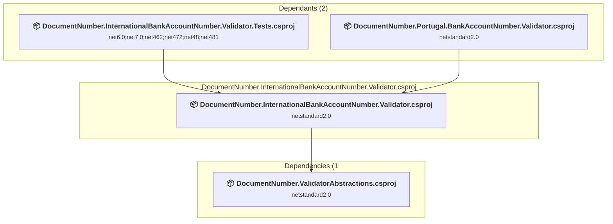

### API Compatibility

| Category | Count | Impact |
| :--- | :---: | :--- |
| 🔴 Binary Incompatible | 0 | High - Require code changes |
| 🟡 Source Incompatible | 0 | Medium - Needs re-compilation and potential conflicting API error fixing |
| 🔵 Behavioral change | 0 | Low - Behavioral changes that may require testing at runtime |
| ✅ Compatible | 88 |  |
| ***Total APIs Analyzed*** | ***88*** |  |

<a id="srcdocumentnumberpaymentcardnumberamericanexpressgeneratordocumentnumberpaymentcardnumberamericanexpressgeneratorcsproj"></a>
### src\DocumentNumber.PaymentCardNumber.AmericanExpress.Generator\DocumentNumber.PaymentCardNumber.AmericanExpress.Generator.csproj

#### Project Info

- **Current Target Framework:** netstandard2.0✅
- **SDK-style**: True
- **Project Kind:** ClassLibrary
- **Dependencies**: 2
- **Dependants**: 1
- **Number of Files**: 1
- **Lines of Code**: 13
- **Estimated LOC to modify**: 0+ (at least 0.0% of the project)

#### Dependency Graph

Legend:
📦 SDK-style project
⚙️ Classic project

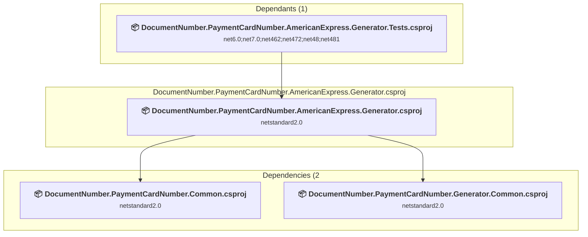

### API Compatibility

| Category | Count | Impact |
| :--- | :---: | :--- |
| 🔴 Binary Incompatible | 0 | High - Require code changes |
| 🟡 Source Incompatible | 0 | Medium - Needs re-compilation and potential conflicting API error fixing |
| 🔵 Behavioral change | 0 | Low - Behavioral changes that may require testing at runtime |
| ✅ Compatible | 4 |  |
| ***Total APIs Analyzed*** | ***4*** |  |

<a id="srcdocumentnumberpaymentcardnumberamericanexpressvalidatordocumentnumberpaymentcardnumberamericanexpressvalidatorcsproj"></a>
### src\DocumentNumber.PaymentCardNumber.AmericanExpress.Validator\DocumentNumber.PaymentCardNumber.AmericanExpress.Validator.csproj

#### Project Info

- **Current Target Framework:** netstandard2.0✅
- **SDK-style**: True
- **Project Kind:** ClassLibrary
- **Dependencies**: 2
- **Dependants**: 2
- **Number of Files**: 2
- **Lines of Code**: 68
- **Estimated LOC to modify**: 0+ (at least 0.0% of the project)

#### Dependency Graph

Legend:
📦 SDK-style project
⚙️ Classic project

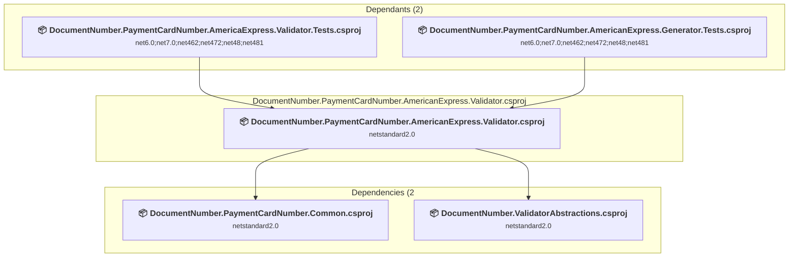

### API Compatibility

| Category | Count | Impact |
| :--- | :---: | :--- |
| 🔴 Binary Incompatible | 0 | High - Require code changes |
| 🟡 Source Incompatible | 0 | Medium - Needs re-compilation and potential conflicting API error fixing |
| 🔵 Behavioral change | 0 | Low - Behavioral changes that may require testing at runtime |
| ✅ Compatible | 28 |  |
| ***Total APIs Analyzed*** | ***28*** |  |

<a id="srcdocumentnumberpaymentcardnumbercommondocumentnumberpaymentcardnumbercommoncsproj"></a>
### src\DocumentNumber.PaymentCardNumber.Common\DocumentNumber.PaymentCardNumber.Common.csproj

#### Project Info

- **Current Target Framework:** netstandard2.0✅
- **SDK-style**: True
- **Project Kind:** ClassLibrary
- **Dependencies**: 1
- **Dependants**: 12
- **Number of Files**: 8
- **Lines of Code**: 134
- **Estimated LOC to modify**: 0+ (at least 0.0% of the project)

#### Dependency Graph

Legend:
📦 SDK-style project
⚙️ Classic project

```mermaid
flowchart TB
    subgraph upstream["Dependants (12)"]
        P8["<b>📦&nbsp;DocumentNumber.PaymentCardNumber.VISA.Validator.csproj</b><br/><small>netstandard2.0</small>"]
        P11["<b>📦&nbsp;DocumentNumber.PaymentCardNumber.Common.Tests.csproj</b><br/><small>net6.0;net7.0;net462;net472;net48;net481</small>"]
        P12["<b>📦&nbsp;DocumentNumber.PaymentCardNumber.VISAElectron.Validator.csproj</b><br/><small>netstandard2.0</small>"]
        P18["<b>📦&nbsp;DocumentNumber.PaymentCardNumber.AmericanExpress.Validator.csproj</b><br/><small>netstandard2.0</small>"]
        P19["<b>📦&nbsp;DocumentNumber.PaymentCardNumber.Maestro.Validator.csproj</b><br/><small>netstandard2.0</small>"]
        P20["<b>📦&nbsp;DocumentNumber.PaymentCardNumber.MaestroUK.Validator.csproj</b><br/><small>netstandard2.0</small>"]
        P21["<b>📦&nbsp;DocumentNumber.PaymentCardNumber.Mastercard.Validator.csproj</b><br/><small>netstandard2.0</small>"]
        P34["<b>📦&nbsp;DocumentNumber.PaymentCardNumber.AmericanExpress.Generator.csproj</b><br/><small>netstandard2.0</small>"]
        P37["<b>📦&nbsp;DocumentNumber.PaymentCardNumber.Maestro.Generator.csproj</b><br/><small>netstandard2.0</small>"]
        P40["<b>📦&nbsp;DocumentNumber.PaymentCardNumber.Mastercard.Generator.csproj</b><br/><small>netstandard2.0</small>"]
        P42["<b>📦&nbsp;DocumentNumber.PaymentCardNumber.VISA.Generator.csproj</b><br/><small>netstandard2.0</small>"]
        P44["<b>📦&nbsp;DocumentNumber.PaymentCardNumber.VISAElectron.Generator.csproj</b><br/><small>netstandard2.0</small>"]
        click P8 "#srcdocumentnumberpaymentcardnumbervisavalidatordocumentnumberpaymentcardnumbervisavalidatorcsproj"
        click P11 "#testsdocumentnumberpaymentcardnumbercommontestsdocumentnumberpaymentcardnumbercommontestscsproj"
        click P12 "#srcdocumentnumberpaymentcardnumbervisaelectronvalidatordocumentnumberpaymentcardnumbervisaelectronvalidatorcsproj"
        click P18 "#srcdocumentnumberpaymentcardnumberamericanexpressvalidatordocumentnumberpaymentcardnumberamericanexpressvalidatorcsproj"
        click P19 "#srcdocumentnumberpaymentcardnumbermaestrovalidatordocumentnumberpaymentcardnumbermaestrovalidatorcsproj"
        click P20 "#srcdocumentnumberpaymentcardnumbermaestroukvalidatordocumentnumberpaymentcardnumbermaestroukvalidatorcsproj"
        click P21 "#srcdocumentnumberpaymentcardnumbermastercardvalidatordocumentnumberpaymentcardnumbermastercardvalidatorcsproj"
        click P34 "#srcdocumentnumberpaymentcardnumberamericanexpressgeneratordocumentnumberpaymentcardnumberamericanexpressgeneratorcsproj"
        click P37 "#srcdocumentnumberpaymentcardnumbermaestrogeneratordocumentnumberpaymentcardnumbermaestrogeneratorcsproj"
        click P40 "#srcdocumentnumberpaymentcardnumbermastercardgeneratordocumentnumberpaymentcardnumbermastercardgeneratorcsproj"
        click P42 "#srcdocumentnumberpaymentcardnumbervisageneratordocumentnumberpaymentcardnumbervisageneratorcsproj"
        click P44 "#srcdocumentnumberpaymentcardnumbervisaelectrongeneratordocumentnumberpaymentcardnumbervisaelectrongeneratorcsproj"
    end
    subgraph current["DocumentNumber.PaymentCardNumber.Common.csproj"]
        MAIN["<b>📦&nbsp;DocumentNumber.PaymentCardNumber.Common.csproj</b><br/><small>netstandard2.0</small>"]
        click MAIN "#srcdocumentnumberpaymentcardnumbercommondocumentnumberpaymentcardnumbercommoncsproj"
    end
    subgraph downstream["Dependencies (1"]
        P3["<b>📦&nbsp;DocumentNumber.ValidatorAbstractions.csproj</b><br/><small>netstandard2.0</small>"]
        click P3 "#srcdocumentnumbervalidatorabstractionsdocumentnumbervalidatorabstractionscsproj"
    end
    P8 --> MAIN
    P11 --> MAIN
    P12 --> MAIN
    P18 --> MAIN
    P19 --> MAIN
    P20 --> MAIN
    P21 --> MAIN
    P34 --> MAIN
    P37 --> MAIN
    P40 --> MAIN
    P42 --> MAIN
    P44 --> MAIN
    MAIN --> P3

```

### API Compatibility

| Category | Count | Impact |
| :--- | :---: | :--- |
| 🔴 Binary Incompatible | 0 | High - Require code changes |
| 🟡 Source Incompatible | 0 | Medium - Needs re-compilation and potential conflicting API error fixing |
| 🔵 Behavioral change | 0 | Low - Behavioral changes that may require testing at runtime |
| ✅ Compatible | 65 |  |
| ***Total APIs Analyzed*** | ***65*** |  |

<a id="srcdocumentnumberpaymentcardnumbergeneratorcommondocumentnumberpaymentcardnumbergeneratorcommoncsproj"></a>
### src\DocumentNumber.PaymentCardNumber.Generator.Common\DocumentNumber.PaymentCardNumber.Generator.Common.csproj

#### Project Info

- **Current Target Framework:** netstandard2.0✅
- **SDK-style**: True
- **Project Kind:** ClassLibrary
- **Dependencies**: 0
- **Dependants**: 6
- **Number of Files**: 2
- **Lines of Code**: 72
- **Estimated LOC to modify**: 0+ (at least 0.0% of the project)

#### Dependency Graph

Legend:
📦 SDK-style project
⚙️ Classic project

```mermaid
flowchart TB
    subgraph upstream["Dependants (6)"]
        P34["<b>📦&nbsp;DocumentNumber.PaymentCardNumber.AmericanExpress.Generator.csproj</b><br/><small>netstandard2.0</small>"]
        P37["<b>📦&nbsp;DocumentNumber.PaymentCardNumber.Maestro.Generator.csproj</b><br/><small>netstandard2.0</small>"]
        P38["<b>📦&nbsp;DocumentNumber.PaymentCardNumber.MaestroUK.Generator.csproj</b><br/><small>netstandard2.0</small>"]
        P40["<b>📦&nbsp;DocumentNumber.PaymentCardNumber.Mastercard.Generator.csproj</b><br/><small>netstandard2.0</small>"]
        P42["<b>📦&nbsp;DocumentNumber.PaymentCardNumber.VISA.Generator.csproj</b><br/><small>netstandard2.0</small>"]
        P44["<b>📦&nbsp;DocumentNumber.PaymentCardNumber.VISAElectron.Generator.csproj</b><br/><small>netstandard2.0</small>"]
        click P34 "#srcdocumentnumberpaymentcardnumberamericanexpressgeneratordocumentnumberpaymentcardnumberamericanexpressgeneratorcsproj"
        click P37 "#srcdocumentnumberpaymentcardnumbermaestrogeneratordocumentnumberpaymentcardnumbermaestrogeneratorcsproj"
        click P38 "#srcdocumentnumberpaymentcardnumbermaestroukgeneratordocumentnumberpaymentcardnumbermaestroukgeneratorcsproj"
        click P40 "#srcdocumentnumberpaymentcardnumbermastercardgeneratordocumentnumberpaymentcardnumbermastercardgeneratorcsproj"
        click P42 "#srcdocumentnumberpaymentcardnumbervisageneratordocumentnumberpaymentcardnumbervisageneratorcsproj"
        click P44 "#srcdocumentnumberpaymentcardnumbervisaelectrongeneratordocumentnumberpaymentcardnumbervisaelectrongeneratorcsproj"
    end
    subgraph current["DocumentNumber.PaymentCardNumber.Generator.Common.csproj"]
        MAIN["<b>📦&nbsp;DocumentNumber.PaymentCardNumber.Generator.Common.csproj</b><br/><small>netstandard2.0</small>"]
        click MAIN "#srcdocumentnumberpaymentcardnumbergeneratorcommondocumentnumberpaymentcardnumbergeneratorcommoncsproj"
    end
    P34 --> MAIN
    P37 --> MAIN
    P38 --> MAIN
    P40 --> MAIN
    P42 --> MAIN
    P44 --> MAIN

```

### API Compatibility

| Category | Count | Impact |
| :--- | :---: | :--- |
| 🔴 Binary Incompatible | 0 | High - Require code changes |
| 🟡 Source Incompatible | 0 | Medium - Needs re-compilation and potential conflicting API error fixing |
| 🔵 Behavioral change | 0 | Low - Behavioral changes that may require testing at runtime |
| ✅ Compatible | 44 |  |
| ***Total APIs Analyzed*** | ***44*** |  |

<a id="srcdocumentnumberpaymentcardnumbermaestrogeneratordocumentnumberpaymentcardnumbermaestrogeneratorcsproj"></a>
### src\DocumentNumber.PaymentCardNumber.Maestro.Generator\DocumentNumber.PaymentCardNumber.Maestro.Generator.csproj

#### Project Info

- **Current Target Framework:** netstandard2.0✅
- **SDK-style**: True
- **Project Kind:** ClassLibrary
- **Dependencies**: 2
- **Dependants**: 1
- **Number of Files**: 1
- **Lines of Code**: 13
- **Estimated LOC to modify**: 0+ (at least 0.0% of the project)

#### Dependency Graph

Legend:
📦 SDK-style project
⚙️ Classic project

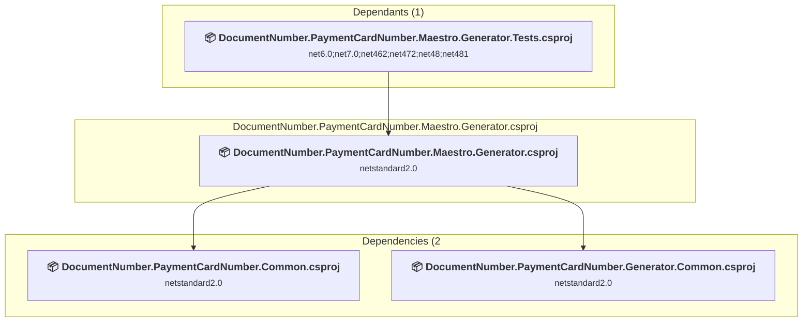

### API Compatibility

| Category | Count | Impact |
| :--- | :---: | :--- |
| 🔴 Binary Incompatible | 0 | High - Require code changes |
| 🟡 Source Incompatible | 0 | Medium - Needs re-compilation and potential conflicting API error fixing |
| 🔵 Behavioral change | 0 | Low - Behavioral changes that may require testing at runtime |
| ✅ Compatible | 4 |  |
| ***Total APIs Analyzed*** | ***4*** |  |

<a id="srcdocumentnumberpaymentcardnumbermaestrovalidatordocumentnumberpaymentcardnumbermaestrovalidatorcsproj"></a>
### src\DocumentNumber.PaymentCardNumber.Maestro.Validator\DocumentNumber.PaymentCardNumber.Maestro.Validator.csproj

#### Project Info

- **Current Target Framework:** netstandard2.0✅
- **SDK-style**: True
- **Project Kind:** ClassLibrary
- **Dependencies**: 2
- **Dependants**: 2
- **Number of Files**: 2
- **Lines of Code**: 76
- **Estimated LOC to modify**: 0+ (at least 0.0% of the project)

#### Dependency Graph

Legend:
📦 SDK-style project
⚙️ Classic project

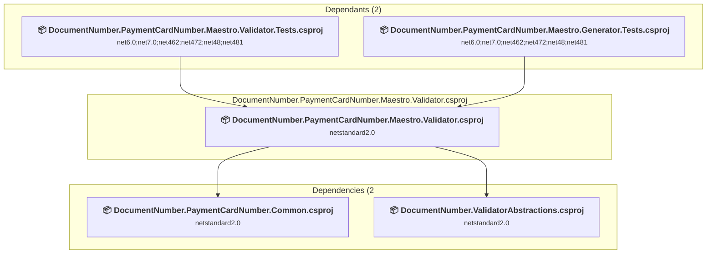

### API Compatibility

| Category | Count | Impact |
| :--- | :---: | :--- |
| 🔴 Binary Incompatible | 0 | High - Require code changes |
| 🟡 Source Incompatible | 0 | Medium - Needs re-compilation and potential conflicting API error fixing |
| 🔵 Behavioral change | 0 | Low - Behavioral changes that may require testing at runtime |
| ✅ Compatible | 43 |  |
| ***Total APIs Analyzed*** | ***43*** |  |

<a id="srcdocumentnumberpaymentcardnumbermaestroukgeneratordocumentnumberpaymentcardnumbermaestroukgeneratorcsproj"></a>
### src\DocumentNumber.PaymentCardNumber.MaestroUK.Generator\DocumentNumber.PaymentCardNumber.MaestroUK.Generator.csproj

#### Project Info

- **Current Target Framework:** netstandard2.0✅
- **SDK-style**: True
- **Project Kind:** ClassLibrary
- **Dependencies**: 1
- **Dependants**: 1
- **Number of Files**: 1
- **Lines of Code**: 13
- **Estimated LOC to modify**: 0+ (at least 0.0% of the project)

#### Dependency Graph

Legend:
📦 SDK-style project
⚙️ Classic project

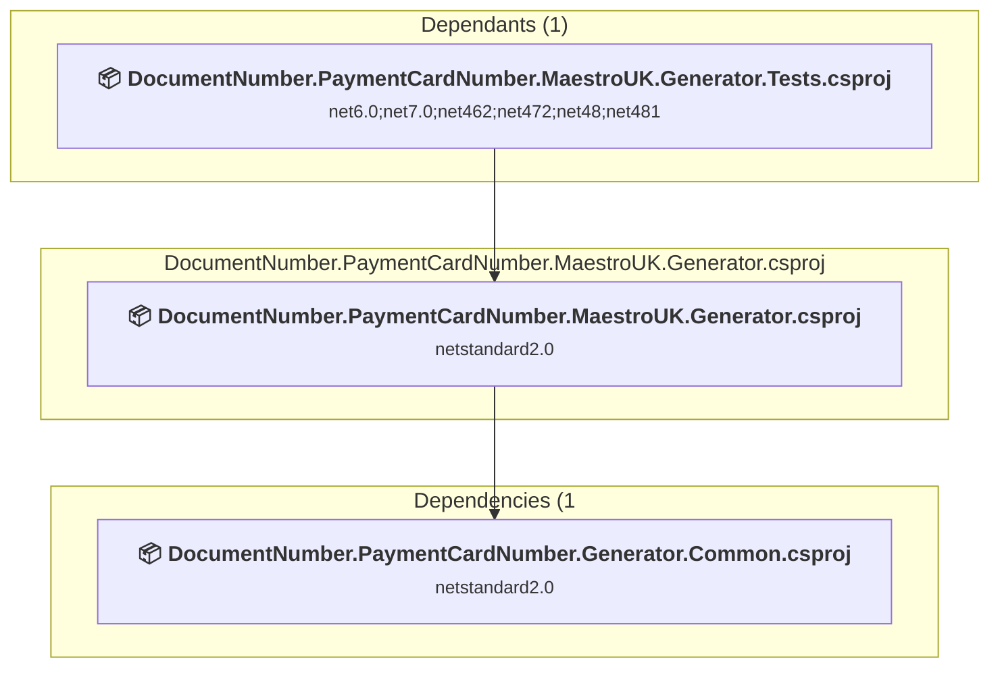

### API Compatibility

| Category | Count | Impact |
| :--- | :---: | :--- |
| 🔴 Binary Incompatible | 0 | High - Require code changes |
| 🟡 Source Incompatible | 0 | Medium - Needs re-compilation and potential conflicting API error fixing |
| 🔵 Behavioral change | 0 | Low - Behavioral changes that may require testing at runtime |
| ✅ Compatible | 4 |  |
| ***Total APIs Analyzed*** | ***4*** |  |

<a id="srcdocumentnumberpaymentcardnumbermaestroukvalidatordocumentnumberpaymentcardnumbermaestroukvalidatorcsproj"></a>
### src\DocumentNumber.PaymentCardNumber.MaestroUK.Validator\DocumentNumber.PaymentCardNumber.MaestroUK.Validator.csproj

#### Project Info

- **Current Target Framework:** netstandard2.0✅
- **SDK-style**: True
- **Project Kind:** ClassLibrary
- **Dependencies**: 2
- **Dependants**: 2
- **Number of Files**: 2
- **Lines of Code**: 79
- **Estimated LOC to modify**: 0+ (at least 0.0% of the project)

#### Dependency Graph

Legend:
📦 SDK-style project
⚙️ Classic project

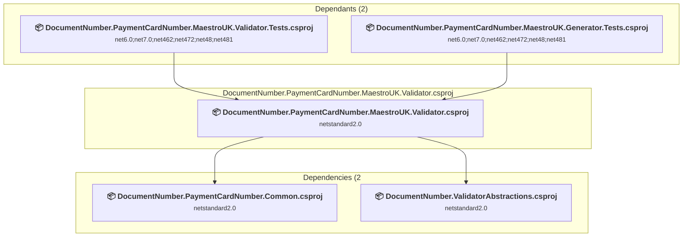

### API Compatibility

| Category | Count | Impact |
| :--- | :---: | :--- |
| 🔴 Binary Incompatible | 0 | High - Require code changes |
| 🟡 Source Incompatible | 0 | Medium - Needs re-compilation and potential conflicting API error fixing |
| 🔵 Behavioral change | 0 | Low - Behavioral changes that may require testing at runtime |
| ✅ Compatible | 40 |  |
| ***Total APIs Analyzed*** | ***40*** |  |

<a id="srcdocumentnumberpaymentcardnumbermastercardgeneratordocumentnumberpaymentcardnumbermastercardgeneratorcsproj"></a>
### src\DocumentNumber.PaymentCardNumber.Mastercard.Generator\DocumentNumber.PaymentCardNumber.Mastercard.Generator.csproj

#### Project Info

- **Current Target Framework:** netstandard2.0✅
- **SDK-style**: True
- **Project Kind:** ClassLibrary
- **Dependencies**: 2
- **Dependants**: 1
- **Number of Files**: 1
- **Lines of Code**: 33
- **Estimated LOC to modify**: 0+ (at least 0.0% of the project)

#### Dependency Graph

Legend:
📦 SDK-style project
⚙️ Classic project

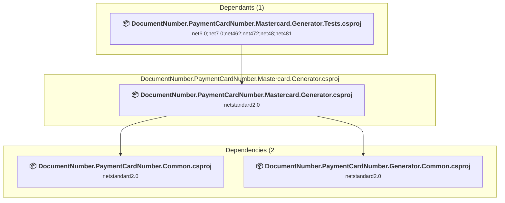

### API Compatibility

| Category | Count | Impact |
| :--- | :---: | :--- |
| 🔴 Binary Incompatible | 0 | High - Require code changes |
| 🟡 Source Incompatible | 0 | Medium - Needs re-compilation and potential conflicting API error fixing |
| 🔵 Behavioral change | 0 | Low - Behavioral changes that may require testing at runtime |
| ✅ Compatible | 14 |  |
| ***Total APIs Analyzed*** | ***14*** |  |

<a id="srcdocumentnumberpaymentcardnumbermastercardvalidatordocumentnumberpaymentcardnumbermastercardvalidatorcsproj"></a>
### src\DocumentNumber.PaymentCardNumber.Mastercard.Validator\DocumentNumber.PaymentCardNumber.Mastercard.Validator.csproj

#### Project Info

- **Current Target Framework:** netstandard2.0✅
- **SDK-style**: True
- **Project Kind:** ClassLibrary
- **Dependencies**: 2
- **Dependants**: 2
- **Number of Files**: 2
- **Lines of Code**: 78
- **Estimated LOC to modify**: 0+ (at least 0.0% of the project)

#### Dependency Graph

Legend:
📦 SDK-style project
⚙️ Classic project

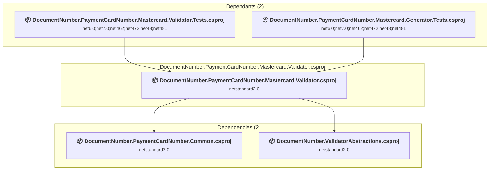

### API Compatibility

| Category | Count | Impact |
| :--- | :---: | :--- |
| 🔴 Binary Incompatible | 0 | High - Require code changes |
| 🟡 Source Incompatible | 0 | Medium - Needs re-compilation and potential conflicting API error fixing |
| 🔵 Behavioral change | 0 | Low - Behavioral changes that may require testing at runtime |
| ✅ Compatible | 36 |  |
| ***Total APIs Analyzed*** | ***36*** |  |

<a id="srcdocumentnumberpaymentcardnumbervisageneratordocumentnumberpaymentcardnumbervisageneratorcsproj"></a>
### src\DocumentNumber.PaymentCardNumber.VISA.Generator\DocumentNumber.PaymentCardNumber.VISA.Generator.csproj

#### Project Info

- **Current Target Framework:** netstandard2.0✅
- **SDK-style**: True
- **Project Kind:** ClassLibrary
- **Dependencies**: 2
- **Dependants**: 1
- **Number of Files**: 1
- **Lines of Code**: 13
- **Estimated LOC to modify**: 0+ (at least 0.0% of the project)

#### Dependency Graph

Legend:
📦 SDK-style project
⚙️ Classic project

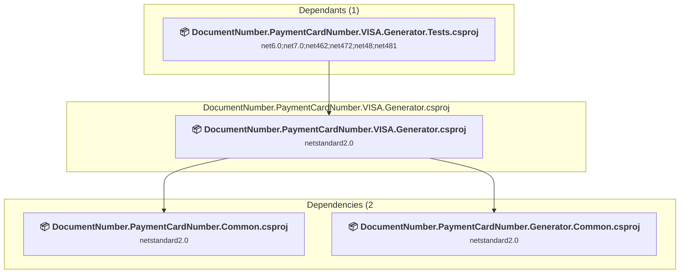

### API Compatibility

| Category | Count | Impact |
| :--- | :---: | :--- |
| 🔴 Binary Incompatible | 0 | High - Require code changes |
| 🟡 Source Incompatible | 0 | Medium - Needs re-compilation and potential conflicting API error fixing |
| 🔵 Behavioral change | 0 | Low - Behavioral changes that may require testing at runtime |
| ✅ Compatible | 4 |  |
| ***Total APIs Analyzed*** | ***4*** |  |

<a id="srcdocumentnumberpaymentcardnumbervisavalidatordocumentnumberpaymentcardnumbervisavalidatorcsproj"></a>
### src\DocumentNumber.PaymentCardNumber.VISA.Validator\DocumentNumber.PaymentCardNumber.VISA.Validator.csproj

#### Project Info

- **Current Target Framework:** netstandard2.0✅
- **SDK-style**: True
- **Project Kind:** ClassLibrary
- **Dependencies**: 2
- **Dependants**: 2
- **Number of Files**: 2
- **Lines of Code**: 49
- **Estimated LOC to modify**: 0+ (at least 0.0% of the project)

#### Dependency Graph

Legend:
📦 SDK-style project
⚙️ Classic project

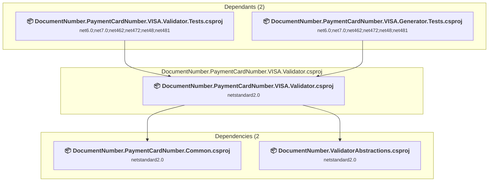

### API Compatibility

| Category | Count | Impact |
| :--- | :---: | :--- |
| 🔴 Binary Incompatible | 0 | High - Require code changes |
| 🟡 Source Incompatible | 0 | Medium - Needs re-compilation and potential conflicting API error fixing |
| 🔵 Behavioral change | 0 | Low - Behavioral changes that may require testing at runtime |
| ✅ Compatible | 23 |  |
| ***Total APIs Analyzed*** | ***23*** |  |

<a id="srcdocumentnumberpaymentcardnumbervisaelectrongeneratordocumentnumberpaymentcardnumbervisaelectrongeneratorcsproj"></a>
### src\DocumentNumber.PaymentCardNumber.VISAElectron.Generator\DocumentNumber.PaymentCardNumber.VISAElectron.Generator.csproj

#### Project Info

- **Current Target Framework:** netstandard2.0✅
- **SDK-style**: True
- **Project Kind:** ClassLibrary
- **Dependencies**: 2
- **Dependants**: 1
- **Number of Files**: 1
- **Lines of Code**: 13
- **Estimated LOC to modify**: 0+ (at least 0.0% of the project)

#### Dependency Graph

Legend:
📦 SDK-style project
⚙️ Classic project

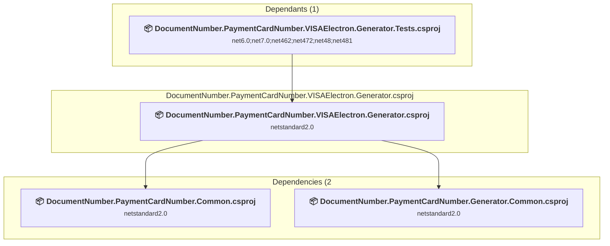

### API Compatibility

| Category | Count | Impact |
| :--- | :---: | :--- |
| 🔴 Binary Incompatible | 0 | High - Require code changes |
| 🟡 Source Incompatible | 0 | Medium - Needs re-compilation and potential conflicting API error fixing |
| 🔵 Behavioral change | 0 | Low - Behavioral changes that may require testing at runtime |
| ✅ Compatible | 4 |  |
| ***Total APIs Analyzed*** | ***4*** |  |

<a id="srcdocumentnumberpaymentcardnumbervisaelectronvalidatordocumentnumberpaymentcardnumbervisaelectronvalidatorcsproj"></a>
### src\DocumentNumber.PaymentCardNumber.VISAElectron.Validator\DocumentNumber.PaymentCardNumber.VISAElectron.Validator.csproj

#### Project Info

- **Current Target Framework:** netstandard2.0✅
- **SDK-style**: True
- **Project Kind:** ClassLibrary
- **Dependencies**: 2
- **Dependants**: 2
- **Number of Files**: 2
- **Lines of Code**: 70
- **Estimated LOC to modify**: 0+ (at least 0.0% of the project)

#### Dependency Graph

Legend:
📦 SDK-style project
⚙️ Classic project

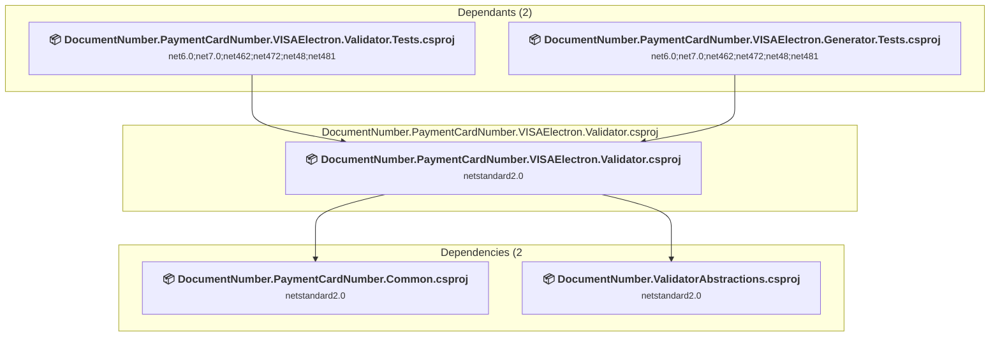

### API Compatibility

| Category | Count | Impact |
| :--- | :---: | :--- |
| 🔴 Binary Incompatible | 0 | High - Require code changes |
| 🟡 Source Incompatible | 0 | Medium - Needs re-compilation and potential conflicting API error fixing |
| 🔵 Behavioral change | 0 | Low - Behavioral changes that may require testing at runtime |
| ✅ Compatible | 28 |  |
| ***Total APIs Analyzed*** | ***28*** |  |

<a id="srcdocumentnumberportugalbankaccountnumbergeneratordocumentnumberportugalbankaccountnumbergeneratorcsproj"></a>
### src\DocumentNumber.Portugal.BankAccountNumber.Generator\DocumentNumber.Portugal.BankAccountNumber.Generator.csproj

#### Project Info

- **Current Target Framework:** netstandard2.0✅
- **SDK-style**: True
- **Project Kind:** ClassLibrary
- **Dependencies**: 0
- **Dependants**: 1
- **Number of Files**: 3
- **Lines of Code**: 48
- **Estimated LOC to modify**: 0+ (at least 0.0% of the project)

#### Dependency Graph

Legend:
📦 SDK-style project
⚙️ Classic project

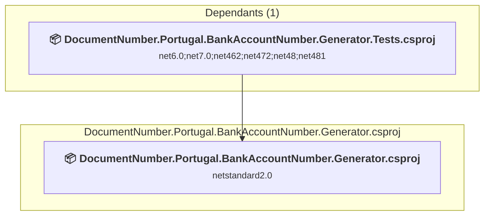

### API Compatibility

| Category | Count | Impact |
| :--- | :---: | :--- |
| 🔴 Binary Incompatible | 0 | High - Require code changes |
| 🟡 Source Incompatible | 0 | Medium - Needs re-compilation and potential conflicting API error fixing |
| 🔵 Behavioral change | 0 | Low - Behavioral changes that may require testing at runtime |
| ✅ Compatible | 21 |  |
| ***Total APIs Analyzed*** | ***21*** |  |

<a id="srcdocumentnumberportugalbankaccountnumbervalidatordocumentnumberportugalbankaccountnumbervalidatorcsproj"></a>
### src\DocumentNumber.Portugal.BankAccountNumber.Validator\DocumentNumber.Portugal.BankAccountNumber.Validator.csproj

#### Project Info

- **Current Target Framework:** netstandard2.0✅
- **SDK-style**: True
- **Project Kind:** ClassLibrary
- **Dependencies**: 2
- **Dependants**: 2
- **Number of Files**: 2
- **Lines of Code**: 41
- **Estimated LOC to modify**: 0+ (at least 0.0% of the project)

#### Dependency Graph

Legend:
📦 SDK-style project
⚙️ Classic project

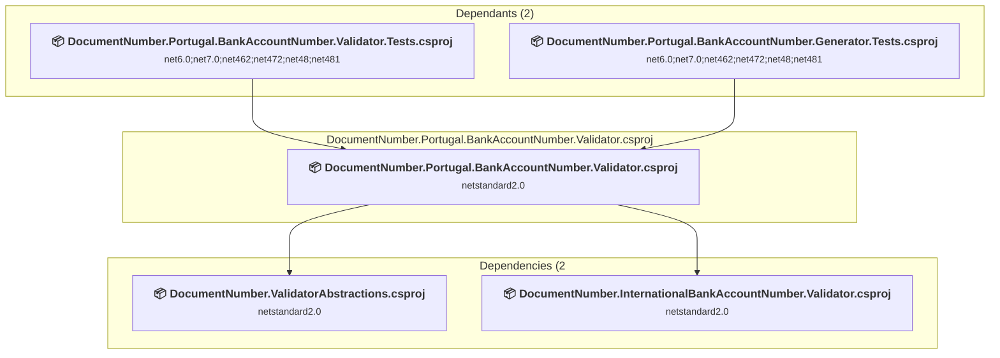

### API Compatibility

| Category | Count | Impact |
| :--- | :---: | :--- |
| 🔴 Binary Incompatible | 0 | High - Require code changes |
| 🟡 Source Incompatible | 0 | Medium - Needs re-compilation and potential conflicting API error fixing |
| 🔵 Behavioral change | 0 | Low - Behavioral changes that may require testing at runtime |
| ✅ Compatible | 21 |  |
| ***Total APIs Analyzed*** | ***21*** |  |

<a id="srcdocumentnumberportugalcitizencardgeneratordocumentnumberportugalcitizencardgeneratorcsproj"></a>
### src\DocumentNumber.Portugal.CitizenCard.Generator\DocumentNumber.Portugal.CitizenCard.Generator.csproj

#### Project Info

- **Current Target Framework:** netstandard2.0✅
- **SDK-style**: True
- **Project Kind:** ClassLibrary
- **Dependencies**: 0
- **Dependants**: 1
- **Number of Files**: 2
- **Lines of Code**: 103
- **Estimated LOC to modify**: 0+ (at least 0.0% of the project)

#### Dependency Graph

Legend:
📦 SDK-style project
⚙️ Classic project

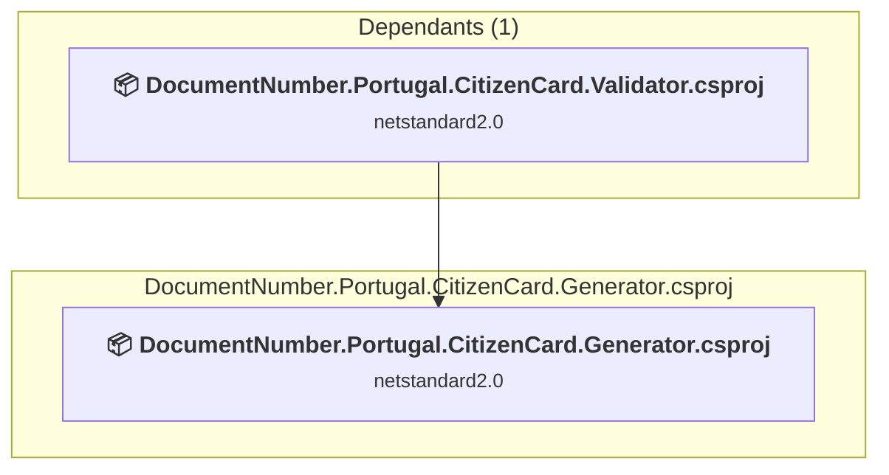

### API Compatibility

| Category | Count | Impact |
| :--- | :---: | :--- |
| 🔴 Binary Incompatible | 0 | High - Require code changes |
| 🟡 Source Incompatible | 0 | Medium - Needs re-compilation and potential conflicting API error fixing |
| 🔵 Behavioral change | 0 | Low - Behavioral changes that may require testing at runtime |
| ✅ Compatible | 41 |  |
| ***Total APIs Analyzed*** | ***41*** |  |

<a id="srcdocumentnumberportugalcitizencardvalidatordocumentnumberportugalcitizencardvalidatorcsproj"></a>
### src\DocumentNumber.Portugal.CitizenCard.Validator\DocumentNumber.Portugal.CitizenCard.Validator.csproj

#### Project Info

- **Current Target Framework:** netstandard2.0✅
- **SDK-style**: True
- **Project Kind:** ClassLibrary
- **Dependencies**: 2
- **Dependants**: 2
- **Number of Files**: 2
- **Lines of Code**: 71
- **Estimated LOC to modify**: 0+ (at least 0.0% of the project)

#### Dependency Graph

Legend:
📦 SDK-style project
⚙️ Classic project

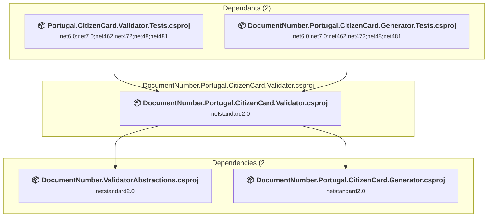

### API Compatibility

| Category | Count | Impact |
| :--- | :---: | :--- |
| 🔴 Binary Incompatible | 0 | High - Require code changes |
| 🟡 Source Incompatible | 0 | Medium - Needs re-compilation and potential conflicting API error fixing |
| 🔵 Behavioral change | 0 | Low - Behavioral changes that may require testing at runtime |
| ✅ Compatible | 41 |  |
| ***Total APIs Analyzed*** | ***41*** |  |

<a id="srcdocumentnumberportugalnifgeneratordocumentnumberportugalnifgeneratorcsproj"></a>
### src\DocumentNumber.Portugal.Nif.Generator\DocumentNumber.Portugal.Nif.Generator.csproj

#### Project Info

- **Current Target Framework:** netstandard2.0✅
- **SDK-style**: True
- **Project Kind:** ClassLibrary
- **Dependencies**: 0
- **Dependants**: 1
- **Number of Files**: 2
- **Lines of Code**: 80
- **Estimated LOC to modify**: 0+ (at least 0.0% of the project)

#### Dependency Graph

Legend:
📦 SDK-style project
⚙️ Classic project

```mermaid
flowchart TB
    subgraph upstream["Dependants (1)"]
        P1["<b>📦&nbsp;DocumentNumber.Portugal.Nif.Validator.csproj</b><br/><small>netstandard2.0</small>"]
        click P1 "#srcdocumentnumberportugalnifvalidatordocumentnumberportugalnifvalidatorcsproj"
    end
    subgraph current["DocumentNumber.Portugal.Nif.Generator.csproj"]
        MAIN["<b>📦&nbsp;DocumentNumber.Portugal.Nif.Generator.csproj</b><br/><small>netstandard2.0</small>"]
        click MAIN "#srcdocumentnumberportugalnifgeneratordocumentnumberportugalnifgeneratorcsproj"
    end
    P1 --> MAIN

```

### API Compatibility

| Category | Count | Impact |
| :--- | :---: | :--- |
| 🔴 Binary Incompatible | 0 | High - Require code changes |
| 🟡 Source Incompatible | 0 | Medium - Needs re-compilation and potential conflicting API error fixing |
| 🔵 Behavioral change | 0 | Low - Behavioral changes that may require testing at runtime |
| ✅ Compatible | 28 |  |
| ***Total APIs Analyzed*** | ***28*** |  |

<a id="srcdocumentnumberportugalnifvalidatordocumentnumberportugalnifvalidatorcsproj"></a>
### src\DocumentNumber.Portugal.Nif.Validator\DocumentNumber.Portugal.Nif.Validator.csproj

#### Project Info

- **Current Target Framework:** netstandard2.0✅
- **SDK-style**: True
- **Project Kind:** ClassLibrary
- **Dependencies**: 2
- **Dependants**: 2
- **Number of Files**: 2
- **Lines of Code**: 80
- **Estimated LOC to modify**: 0+ (at least 0.0% of the project)

#### Dependency Graph

Legend:
📦 SDK-style project
⚙️ Classic project

```mermaid
flowchart TB
    subgraph upstream["Dependants (2)"]
        P2["<b>📦&nbsp;Portugal.Nif.Validator.Tests.csproj</b><br/><small>net6.0;net7.0;net462;net472;net48;net481</small>"]
        P30["<b>📦&nbsp;DocumentNumber.Portugal.Nif.Generator.Tests.csproj</b><br/><small>net6.0;net7.0;net462;net472;net48;net481</small>"]
        click P2 "#testsportugalnifvalidatortestsportugalnifvalidatortestscsproj"
        click P30 "#testsdocumentnumberportugalnifgeneratortestsdocumentnumberportugalnifgeneratortestscsproj"
    end
    subgraph current["DocumentNumber.Portugal.Nif.Validator.csproj"]
        MAIN["<b>📦&nbsp;DocumentNumber.Portugal.Nif.Validator.csproj</b><br/><small>netstandard2.0</small>"]
        click MAIN "#srcdocumentnumberportugalnifvalidatordocumentnumberportugalnifvalidatorcsproj"
    end
    subgraph downstream["Dependencies (2"]
        P3["<b>📦&nbsp;DocumentNumber.ValidatorAbstractions.csproj</b><br/><small>netstandard2.0</small>"]
        P46["<b>📦&nbsp;DocumentNumber.Portugal.Nif.Generator.csproj</b><br/><small>netstandard2.0</small>"]
        click P3 "#srcdocumentnumbervalidatorabstractionsdocumentnumbervalidatorabstractionscsproj"
        click P46 "#srcdocumentnumberportugalnifgeneratordocumentnumberportugalnifgeneratorcsproj"
    end
    P2 --> MAIN
    P30 --> MAIN
    MAIN --> P3
    MAIN --> P46

```

### API Compatibility

| Category | Count | Impact |
| :--- | :---: | :--- |
| 🔴 Binary Incompatible | 0 | High - Require code changes |
| 🟡 Source Incompatible | 0 | Medium - Needs re-compilation and potential conflicting API error fixing |
| 🔵 Behavioral change | 0 | Low - Behavioral changes that may require testing at runtime |
| ✅ Compatible | 68 |  |
| ***Total APIs Analyzed*** | ***68*** |  |

<a id="srcdocumentnumberportugalnissgeneratordocumentnumberportugalnissgeneratorcsproj"></a>
### src\DocumentNumber.Portugal.Niss.Generator\DocumentNumber.Portugal.Niss.Generator.csproj

#### Project Info

- **Current Target Framework:** netstandard2.0✅
- **SDK-style**: True
- **Project Kind:** ClassLibrary
- **Dependencies**: 0
- **Dependants**: 1
- **Number of Files**: 2
- **Lines of Code**: 54
- **Estimated LOC to modify**: 0+ (at least 0.0% of the project)

#### Dependency Graph

Legend:
📦 SDK-style project
⚙️ Classic project

```mermaid
flowchart TB
    subgraph upstream["Dependants (1)"]
        P4["<b>📦&nbsp;DocumentNumber.Portugal.Niss.Validator.csproj</b><br/><small>netstandard2.0</small>"]
        click P4 "#srcdocumentnumberportugalnissvalidatordocumentnumberportugalnissvalidatorcsproj"
    end
    subgraph current["DocumentNumber.Portugal.Niss.Generator.csproj"]
        MAIN["<b>📦&nbsp;DocumentNumber.Portugal.Niss.Generator.csproj</b><br/><small>netstandard2.0</small>"]
        click MAIN "#srcdocumentnumberportugalnissgeneratordocumentnumberportugalnissgeneratorcsproj"
    end
    P4 --> MAIN

```

### API Compatibility

| Category | Count | Impact |
| :--- | :---: | :--- |
| 🔴 Binary Incompatible | 0 | High - Require code changes |
| 🟡 Source Incompatible | 0 | Medium - Needs re-compilation and potential conflicting API error fixing |
| 🔵 Behavioral change | 0 | Low - Behavioral changes that may require testing at runtime |
| ✅ Compatible | 15 |  |
| ***Total APIs Analyzed*** | ***15*** |  |

<a id="srcdocumentnumberportugalnissvalidatordocumentnumberportugalnissvalidatorcsproj"></a>
### src\DocumentNumber.Portugal.Niss.Validator\DocumentNumber.Portugal.Niss.Validator.csproj

#### Project Info

- **Current Target Framework:** netstandard2.0✅
- **SDK-style**: True
- **Project Kind:** ClassLibrary
- **Dependencies**: 2
- **Dependants**: 2
- **Number of Files**: 2
- **Lines of Code**: 43
- **Estimated LOC to modify**: 0+ (at least 0.0% of the project)

#### Dependency Graph

Legend:
📦 SDK-style project
⚙️ Classic project

```mermaid
flowchart TB
    subgraph upstream["Dependants (2)"]
        P5["<b>📦&nbsp;Portugal.Niss.Validator.Tests.csproj</b><br/><small>net6.0;net7.0;net462;net472;net48;net481</small>"]
        P26["<b>📦&nbsp;DocumentNumber.Portugal.Niss.Generator.Tests.csproj</b><br/><small>net6.0;net7.0;net462;net472;net48;net481</small>"]
        click P5 "#testsportugalnissvalidatortestsportugalnissvalidatortestscsproj"
        click P26 "#testsdocumentnumberportugalnissgeneratortestsdocumentnumberportugalnissgeneratortestscsproj"
    end
    subgraph current["DocumentNumber.Portugal.Niss.Validator.csproj"]
        MAIN["<b>📦&nbsp;DocumentNumber.Portugal.Niss.Validator.csproj</b><br/><small>netstandard2.0</small>"]
        click MAIN "#srcdocumentnumberportugalnissvalidatordocumentnumberportugalnissvalidatorcsproj"
    end
    subgraph downstream["Dependencies (2"]
        P29["<b>📦&nbsp;DocumentNumber.Portugal.Niss.Generator.csproj</b><br/><small>netstandard2.0</small>"]
        P3["<b>📦&nbsp;DocumentNumber.ValidatorAbstractions.csproj</b><br/><small>netstandard2.0</small>"]
        click P29 "#srcdocumentnumberportugalnissgeneratordocumentnumberportugalnissgeneratorcsproj"
        click P3 "#srcdocumentnumbervalidatorabstractionsdocumentnumbervalidatorabstractionscsproj"
    end
    P5 --> MAIN
    P26 --> MAIN
    MAIN --> P29
    MAIN --> P3

```

### API Compatibility

| Category | Count | Impact |
| :--- | :---: | :--- |
| 🔴 Binary Incompatible | 0 | High - Require code changes |
| 🟡 Source Incompatible | 0 | Medium - Needs re-compilation and potential conflicting API error fixing |
| 🔵 Behavioral change | 0 | Low - Behavioral changes that may require testing at runtime |
| ✅ Compatible | 13 |  |
| ***Total APIs Analyzed*** | ***13*** |  |

<a id="srcdocumentnumbervalidatorabstractionsdocumentnumbervalidatorabstractionscsproj"></a>
### src\DocumentNumber.ValidatorAbstractions\DocumentNumber.ValidatorAbstractions.csproj

#### Project Info

- **Current Target Framework:** netstandard2.0✅
- **SDK-style**: True
- **Project Kind:** ClassLibrary
- **Dependencies**: 0
- **Dependants**: 12
- **Number of Files**: 1
- **Lines of Code**: 12
- **Estimated LOC to modify**: 0+ (at least 0.0% of the project)

#### Dependency Graph

Legend:
📦 SDK-style project
⚙️ Classic project

```mermaid
flowchart TB
    subgraph upstream["Dependants (12)"]
        P1["<b>📦&nbsp;DocumentNumber.Portugal.Nif.Validator.csproj</b><br/><small>netstandard2.0</small>"]
        P4["<b>📦&nbsp;DocumentNumber.Portugal.Niss.Validator.csproj</b><br/><small>netstandard2.0</small>"]
        P6["<b>📦&nbsp;DocumentNumber.Portugal.CitizenCard.Validator.csproj</b><br/><small>netstandard2.0</small>"]
        P8["<b>📦&nbsp;DocumentNumber.PaymentCardNumber.VISA.Validator.csproj</b><br/><small>netstandard2.0</small>"]
        P10["<b>📦&nbsp;DocumentNumber.PaymentCardNumber.Common.csproj</b><br/><small>netstandard2.0</small>"]
        P12["<b>📦&nbsp;DocumentNumber.PaymentCardNumber.VISAElectron.Validator.csproj</b><br/><small>netstandard2.0</small>"]
        P18["<b>📦&nbsp;DocumentNumber.PaymentCardNumber.AmericanExpress.Validator.csproj</b><br/><small>netstandard2.0</small>"]
        P19["<b>📦&nbsp;DocumentNumber.PaymentCardNumber.Maestro.Validator.csproj</b><br/><small>netstandard2.0</small>"]
        P20["<b>📦&nbsp;DocumentNumber.PaymentCardNumber.MaestroUK.Validator.csproj</b><br/><small>netstandard2.0</small>"]
        P21["<b>📦&nbsp;DocumentNumber.PaymentCardNumber.Mastercard.Validator.csproj</b><br/><small>netstandard2.0</small>"]
        P22["<b>📦&nbsp;DocumentNumber.InternationalBankAccountNumber.Validator.csproj</b><br/><small>netstandard2.0</small>"]
        P24["<b>📦&nbsp;DocumentNumber.Portugal.BankAccountNumber.Validator.csproj</b><br/><small>netstandard2.0</small>"]
        click P1 "#srcdocumentnumberportugalnifvalidatordocumentnumberportugalnifvalidatorcsproj"
        click P4 "#srcdocumentnumberportugalnissvalidatordocumentnumberportugalnissvalidatorcsproj"
        click P6 "#srcdocumentnumberportugalcitizencardvalidatordocumentnumberportugalcitizencardvalidatorcsproj"
        click P8 "#srcdocumentnumberpaymentcardnumbervisavalidatordocumentnumberpaymentcardnumbervisavalidatorcsproj"
        click P10 "#srcdocumentnumberpaymentcardnumbercommondocumentnumberpaymentcardnumbercommoncsproj"
        click P12 "#srcdocumentnumberpaymentcardnumbervisaelectronvalidatordocumentnumberpaymentcardnumbervisaelectronvalidatorcsproj"
        click P18 "#srcdocumentnumberpaymentcardnumberamericanexpressvalidatordocumentnumberpaymentcardnumberamericanexpressvalidatorcsproj"
        click P19 "#srcdocumentnumberpaymentcardnumbermaestrovalidatordocumentnumberpaymentcardnumbermaestrovalidatorcsproj"
        click P20 "#srcdocumentnumberpaymentcardnumbermaestroukvalidatordocumentnumberpaymentcardnumbermaestroukvalidatorcsproj"
        click P21 "#srcdocumentnumberpaymentcardnumbermastercardvalidatordocumentnumberpaymentcardnumbermastercardvalidatorcsproj"
        click P22 "#srcdocumentnumberinternationalbankaccountnumbervalidatordocumentnumberinternationalbankaccountnumbervalidatorcsproj"
        click P24 "#srcdocumentnumberportugalbankaccountnumbervalidatordocumentnumberportugalbankaccountnumbervalidatorcsproj"
    end
    subgraph current["DocumentNumber.ValidatorAbstractions.csproj"]
        MAIN["<b>📦&nbsp;DocumentNumber.ValidatorAbstractions.csproj</b><br/><small>netstandard2.0</small>"]
        click MAIN "#srcdocumentnumbervalidatorabstractionsdocumentnumbervalidatorabstractionscsproj"
    end
    P1 --> MAIN
    P4 --> MAIN
    P6 --> MAIN
    P8 --> MAIN
    P10 --> MAIN
    P12 --> MAIN
    P18 --> MAIN
    P19 --> MAIN
    P20 --> MAIN
    P21 --> MAIN
    P22 --> MAIN
    P24 --> MAIN

```

### API Compatibility

| Category | Count | Impact |
| :--- | :---: | :--- |
| 🔴 Binary Incompatible | 0 | High - Require code changes |
| 🟡 Source Incompatible | 0 | Medium - Needs re-compilation and potential conflicting API error fixing |
| 🔵 Behavioral change | 0 | Low - Behavioral changes that may require testing at runtime |
| ✅ Compatible | 2 |  |
| ***Total APIs Analyzed*** | ***2*** |  |

<a id="testsdocumentnumberinternationalbankaccountnumbervalidatortestsdocumentnumberinternationalbankaccountnumbervalidatortestscsproj"></a>
### tests\DocumentNumber.InternationalBankAccountNumber.Validator.Tests\DocumentNumber.InternationalBankAccountNumber.Validator.Tests.csproj

#### Project Info

- **Current Target Framework:** net6.0;net7.0;net462;net472;net48;net481
- **Proposed Target Framework:** net6.0;net7.0;net462;net472;net48;net481;net10.0
- **SDK-style**: True
- **Project Kind:** DotNetCoreApp
- **Dependencies**: 1
- **Dependants**: 0
- **Number of Files**: 3
- **Number of Files with Incidents**: 1
- **Lines of Code**: 73
- **Estimated LOC to modify**: 0+ (at least 0.0% of the project)

#### Dependency Graph

Legend:
📦 SDK-style project
⚙️ Classic project

```mermaid
flowchart TB
    subgraph current["DocumentNumber.InternationalBankAccountNumber.Validator.Tests.csproj"]
        MAIN["<b>📦&nbsp;DocumentNumber.InternationalBankAccountNumber.Validator.Tests.csproj</b><br/><small>net6.0;net7.0;net462;net472;net48;net481</small>"]
        click MAIN "#testsdocumentnumberinternationalbankaccountnumbervalidatortestsdocumentnumberinternationalbankaccountnumbervalidatortestscsproj"
    end
    subgraph downstream["Dependencies (1"]
        P22["<b>📦&nbsp;DocumentNumber.InternationalBankAccountNumber.Validator.csproj</b><br/><small>netstandard2.0</small>"]
        click P22 "#srcdocumentnumberinternationalbankaccountnumbervalidatordocumentnumberinternationalbankaccountnumbervalidatorcsproj"
    end
    MAIN --> P22

```

### API Compatibility

| Category | Count | Impact |
| :--- | :---: | :--- |
| 🔴 Binary Incompatible | 0 | High - Require code changes |
| 🟡 Source Incompatible | 0 | Medium - Needs re-compilation and potential conflicting API error fixing |
| 🔵 Behavioral change | 0 | Low - Behavioral changes that may require testing at runtime |
| ✅ Compatible | 59 |  |
| ***Total APIs Analyzed*** | ***59*** |  |

<a id="testsdocumentnumberpaymentcardnumberamericaexpressvalidatortestsdocumentnumberpaymentcardnumberamericaexpressvalidatortestscsproj"></a>
### tests\DocumentNumber.PaymentCardNumber.AmericaExpress.Validator.Tests\DocumentNumber.PaymentCardNumber.AmericaExpress.Validator.Tests.csproj

#### Project Info

- **Current Target Framework:** net6.0;net7.0;net462;net472;net48;net481
- **Proposed Target Framework:** net6.0;net7.0;net462;net472;net48;net481;net10.0
- **SDK-style**: True
- **Project Kind:** DotNetCoreApp
- **Dependencies**: 1
- **Dependants**: 0
- **Number of Files**: 3
- **Number of Files with Incidents**: 1
- **Lines of Code**: 132
- **Estimated LOC to modify**: 0+ (at least 0.0% of the project)

#### Dependency Graph

Legend:
📦 SDK-style project
⚙️ Classic project

```mermaid
flowchart TB
    subgraph current["DocumentNumber.PaymentCardNumber.AmericaExpress.Validator.Tests.csproj"]
        MAIN["<b>📦&nbsp;DocumentNumber.PaymentCardNumber.AmericaExpress.Validator.Tests.csproj</b><br/><small>net6.0;net7.0;net462;net472;net48;net481</small>"]
        click MAIN "#testsdocumentnumberpaymentcardnumberamericaexpressvalidatortestsdocumentnumberpaymentcardnumberamericaexpressvalidatortestscsproj"
    end
    subgraph downstream["Dependencies (1"]
        P18["<b>📦&nbsp;DocumentNumber.PaymentCardNumber.AmericanExpress.Validator.csproj</b><br/><small>netstandard2.0</small>"]
        click P18 "#srcdocumentnumberpaymentcardnumberamericanexpressvalidatordocumentnumberpaymentcardnumberamericanexpressvalidatorcsproj"
    end
    MAIN --> P18

```

### API Compatibility

| Category | Count | Impact |
| :--- | :---: | :--- |
| 🔴 Binary Incompatible | 0 | High - Require code changes |
| 🟡 Source Incompatible | 0 | Medium - Needs re-compilation and potential conflicting API error fixing |
| 🔵 Behavioral change | 0 | Low - Behavioral changes that may require testing at runtime |
| ✅ Compatible | 106 |  |
| ***Total APIs Analyzed*** | ***106*** |  |

<a id="testsdocumentnumberpaymentcardnumberamericanexpressgeneratortestsdocumentnumberpaymentcardnumberamericanexpressgeneratortestscsproj"></a>
### tests\DocumentNumber.PaymentCardNumber.AmericanExpress.Generator.Tests\DocumentNumber.PaymentCardNumber.AmericanExpress.Generator.Tests.csproj

#### Project Info

- **Current Target Framework:** net6.0;net7.0;net462;net472;net48;net481
- **Proposed Target Framework:** net6.0;net7.0;net462;net472;net48;net481;net10.0
- **SDK-style**: True
- **Project Kind:** DotNetCoreApp
- **Dependencies**: 2
- **Dependants**: 0
- **Number of Files**: 3
- **Number of Files with Incidents**: 1
- **Lines of Code**: 60
- **Estimated LOC to modify**: 0+ (at least 0.0% of the project)

#### Dependency Graph

Legend:
📦 SDK-style project
⚙️ Classic project

```mermaid
flowchart TB
    subgraph current["DocumentNumber.PaymentCardNumber.AmericanExpress.Generator.Tests.csproj"]
        MAIN["<b>📦&nbsp;DocumentNumber.PaymentCardNumber.AmericanExpress.Generator.Tests.csproj</b><br/><small>net6.0;net7.0;net462;net472;net48;net481</small>"]
        click MAIN "#testsdocumentnumberpaymentcardnumberamericanexpressgeneratortestsdocumentnumberpaymentcardnumberamericanexpressgeneratortestscsproj"
    end
    subgraph downstream["Dependencies (2"]
        P34["<b>📦&nbsp;DocumentNumber.PaymentCardNumber.AmericanExpress.Generator.csproj</b><br/><small>netstandard2.0</small>"]
        P18["<b>📦&nbsp;DocumentNumber.PaymentCardNumber.AmericanExpress.Validator.csproj</b><br/><small>netstandard2.0</small>"]
        click P34 "#srcdocumentnumberpaymentcardnumberamericanexpressgeneratordocumentnumberpaymentcardnumberamericanexpressgeneratorcsproj"
        click P18 "#srcdocumentnumberpaymentcardnumberamericanexpressvalidatordocumentnumberpaymentcardnumberamericanexpressvalidatorcsproj"
    end
    MAIN --> P34
    MAIN --> P18

```

### API Compatibility

| Category | Count | Impact |
| :--- | :---: | :--- |
| 🔴 Binary Incompatible | 0 | High - Require code changes |
| 🟡 Source Incompatible | 0 | Medium - Needs re-compilation and potential conflicting API error fixing |
| 🔵 Behavioral change | 0 | Low - Behavioral changes that may require testing at runtime |
| ✅ Compatible | 39 |  |
| ***Total APIs Analyzed*** | ***39*** |  |

<a id="testsdocumentnumberpaymentcardnumbercommontestsdocumentnumberpaymentcardnumbercommontestscsproj"></a>
### tests\DocumentNumber.PaymentCardNumber.Common.Tests\DocumentNumber.PaymentCardNumber.Common.Tests.csproj

#### Project Info

- **Current Target Framework:** net6.0;net7.0;net462;net472;net48;net481
- **Proposed Target Framework:** net6.0;net7.0;net462;net472;net48;net481;net10.0
- **SDK-style**: True
- **Project Kind:** DotNetCoreApp
- **Dependencies**: 1
- **Dependants**: 0
- **Number of Files**: 3
- **Number of Files with Incidents**: 1
- **Lines of Code**: 34
- **Estimated LOC to modify**: 0+ (at least 0.0% of the project)

#### Dependency Graph

Legend:
📦 SDK-style project
⚙️ Classic project

```mermaid
flowchart TB
    subgraph current["DocumentNumber.PaymentCardNumber.Common.Tests.csproj"]
        MAIN["<b>📦&nbsp;DocumentNumber.PaymentCardNumber.Common.Tests.csproj</b><br/><small>net6.0;net7.0;net462;net472;net48;net481</small>"]
        click MAIN "#testsdocumentnumberpaymentcardnumbercommontestsdocumentnumberpaymentcardnumbercommontestscsproj"
    end
    subgraph downstream["Dependencies (1"]
        P10["<b>📦&nbsp;DocumentNumber.PaymentCardNumber.Common.csproj</b><br/><small>netstandard2.0</small>"]
        click P10 "#srcdocumentnumberpaymentcardnumbercommondocumentnumberpaymentcardnumbercommoncsproj"
    end
    MAIN --> P10

```

### API Compatibility

| Category | Count | Impact |
| :--- | :---: | :--- |
| 🔴 Binary Incompatible | 0 | High - Require code changes |
| 🟡 Source Incompatible | 0 | Medium - Needs re-compilation and potential conflicting API error fixing |
| 🔵 Behavioral change | 0 | Low - Behavioral changes that may require testing at runtime |
| ✅ Compatible | 29 |  |
| ***Total APIs Analyzed*** | ***29*** |  |

<a id="testsdocumentnumberpaymentcardnumbermaestrogeneratortestsdocumentnumberpaymentcardnumbermaestrogeneratortestscsproj"></a>
### tests\DocumentNumber.PaymentCardNumber.Maestro.Generator.Tests\DocumentNumber.PaymentCardNumber.Maestro.Generator.Tests.csproj

#### Project Info

- **Current Target Framework:** net6.0;net7.0;net462;net472;net48;net481
- **Proposed Target Framework:** net6.0;net7.0;net462;net472;net48;net481;net10.0
- **SDK-style**: True
- **Project Kind:** DotNetCoreApp
- **Dependencies**: 2
- **Dependants**: 0
- **Number of Files**: 3
- **Number of Files with Incidents**: 1
- **Lines of Code**: 65
- **Estimated LOC to modify**: 0+ (at least 0.0% of the project)

#### Dependency Graph

Legend:
📦 SDK-style project
⚙️ Classic project

```mermaid
flowchart TB
    subgraph current["DocumentNumber.PaymentCardNumber.Maestro.Generator.Tests.csproj"]
        MAIN["<b>📦&nbsp;DocumentNumber.PaymentCardNumber.Maestro.Generator.Tests.csproj</b><br/><small>net6.0;net7.0;net462;net472;net48;net481</small>"]
        click MAIN "#testsdocumentnumberpaymentcardnumbermaestrogeneratortestsdocumentnumberpaymentcardnumbermaestrogeneratortestscsproj"
    end
    subgraph downstream["Dependencies (2"]
        P37["<b>📦&nbsp;DocumentNumber.PaymentCardNumber.Maestro.Generator.csproj</b><br/><small>netstandard2.0</small>"]
        P19["<b>📦&nbsp;DocumentNumber.PaymentCardNumber.Maestro.Validator.csproj</b><br/><small>netstandard2.0</small>"]
        click P37 "#srcdocumentnumberpaymentcardnumbermaestrogeneratordocumentnumberpaymentcardnumbermaestrogeneratorcsproj"
        click P19 "#srcdocumentnumberpaymentcardnumbermaestrovalidatordocumentnumberpaymentcardnumbermaestrovalidatorcsproj"
    end
    MAIN --> P37
    MAIN --> P19

```

### API Compatibility

| Category | Count | Impact |
| :--- | :---: | :--- |
| 🔴 Binary Incompatible | 0 | High - Require code changes |
| 🟡 Source Incompatible | 0 | Medium - Needs re-compilation and potential conflicting API error fixing |
| 🔵 Behavioral change | 0 | Low - Behavioral changes that may require testing at runtime |
| ✅ Compatible | 60 |  |
| ***Total APIs Analyzed*** | ***60*** |  |

<a id="testsdocumentnumberpaymentcardnumbermaestrovalidatortestsdocumentnumberpaymentcardnumbermaestrovalidatortestscsproj"></a>
### tests\DocumentNumber.PaymentCardNumber.Maestro.Validator.Tests\DocumentNumber.PaymentCardNumber.Maestro.Validator.Tests.csproj

#### Project Info

- **Current Target Framework:** net6.0;net7.0;net462;net472;net48;net481
- **Proposed Target Framework:** net6.0;net7.0;net462;net472;net48;net481;net10.0
- **SDK-style**: True
- **Project Kind:** DotNetCoreApp
- **Dependencies**: 1
- **Dependants**: 0
- **Number of Files**: 3
- **Number of Files with Incidents**: 1
- **Lines of Code**: 163
- **Estimated LOC to modify**: 0+ (at least 0.0% of the project)

#### Dependency Graph

Legend:
📦 SDK-style project
⚙️ Classic project

```mermaid
flowchart TB
    subgraph current["DocumentNumber.PaymentCardNumber.Maestro.Validator.Tests.csproj"]
        MAIN["<b>📦&nbsp;DocumentNumber.PaymentCardNumber.Maestro.Validator.Tests.csproj</b><br/><small>net6.0;net7.0;net462;net472;net48;net481</small>"]
        click MAIN "#testsdocumentnumberpaymentcardnumbermaestrovalidatortestsdocumentnumberpaymentcardnumbermaestrovalidatortestscsproj"
    end
    subgraph downstream["Dependencies (1"]
        P19["<b>📦&nbsp;DocumentNumber.PaymentCardNumber.Maestro.Validator.csproj</b><br/><small>netstandard2.0</small>"]
        click P19 "#srcdocumentnumberpaymentcardnumbermaestrovalidatordocumentnumberpaymentcardnumbermaestrovalidatorcsproj"
    end
    MAIN --> P19

```

### API Compatibility

| Category | Count | Impact |
| :--- | :---: | :--- |
| 🔴 Binary Incompatible | 0 | High - Require code changes |
| 🟡 Source Incompatible | 0 | Medium - Needs re-compilation and potential conflicting API error fixing |
| 🔵 Behavioral change | 0 | Low - Behavioral changes that may require testing at runtime |
| ✅ Compatible | 156 |  |
| ***Total APIs Analyzed*** | ***156*** |  |

<a id="testsdocumentnumberpaymentcardnumbermaestroukgeneratortestsdocumentnumberpaymentcardnumbermaestroukgeneratortestscsproj"></a>
### tests\DocumentNumber.PaymentCardNumber.MaestroUK.Generator.Tests\DocumentNumber.PaymentCardNumber.MaestroUK.Generator.Tests.csproj

#### Project Info

- **Current Target Framework:** net6.0;net7.0;net462;net472;net48;net481
- **Proposed Target Framework:** net6.0;net7.0;net462;net472;net48;net481;net10.0
- **SDK-style**: True
- **Project Kind:** DotNetCoreApp
- **Dependencies**: 2
- **Dependants**: 0
- **Number of Files**: 3
- **Number of Files with Incidents**: 1
- **Lines of Code**: 60
- **Estimated LOC to modify**: 0+ (at least 0.0% of the project)

#### Dependency Graph

Legend:
📦 SDK-style project
⚙️ Classic project

```mermaid
flowchart TB
    subgraph current["DocumentNumber.PaymentCardNumber.MaestroUK.Generator.Tests.csproj"]
        MAIN["<b>📦&nbsp;DocumentNumber.PaymentCardNumber.MaestroUK.Generator.Tests.csproj</b><br/><small>net6.0;net7.0;net462;net472;net48;net481</small>"]
        click MAIN "#testsdocumentnumberpaymentcardnumbermaestroukgeneratortestsdocumentnumberpaymentcardnumbermaestroukgeneratortestscsproj"
    end
    subgraph downstream["Dependencies (2"]
        P20["<b>📦&nbsp;DocumentNumber.PaymentCardNumber.MaestroUK.Validator.csproj</b><br/><small>netstandard2.0</small>"]
        P38["<b>📦&nbsp;DocumentNumber.PaymentCardNumber.MaestroUK.Generator.csproj</b><br/><small>netstandard2.0</small>"]
        click P20 "#srcdocumentnumberpaymentcardnumbermaestroukvalidatordocumentnumberpaymentcardnumbermaestroukvalidatorcsproj"
        click P38 "#srcdocumentnumberpaymentcardnumbermaestroukgeneratordocumentnumberpaymentcardnumbermaestroukgeneratorcsproj"
    end
    MAIN --> P20
    MAIN --> P38

```

### API Compatibility

| Category | Count | Impact |
| :--- | :---: | :--- |
| 🔴 Binary Incompatible | 0 | High - Require code changes |
| 🟡 Source Incompatible | 0 | Medium - Needs re-compilation and potential conflicting API error fixing |
| 🔵 Behavioral change | 0 | Low - Behavioral changes that may require testing at runtime |
| ✅ Compatible | 47 |  |
| ***Total APIs Analyzed*** | ***47*** |  |

<a id="testsdocumentnumberpaymentcardnumbermaestroukvalidatortestsdocumentnumberpaymentcardnumbermaestroukvalidatortestscsproj"></a>
### tests\DocumentNumber.PaymentCardNumber.MaestroUK.Validator.Tests\DocumentNumber.PaymentCardNumber.MaestroUK.Validator.Tests.csproj

#### Project Info

- **Current Target Framework:** net6.0;net7.0;net462;net472;net48;net481
- **Proposed Target Framework:** net6.0;net7.0;net462;net472;net48;net481;net10.0
- **SDK-style**: True
- **Project Kind:** DotNetCoreApp
- **Dependencies**: 1
- **Dependants**: 0
- **Number of Files**: 3
- **Number of Files with Incidents**: 1
- **Lines of Code**: 154
- **Estimated LOC to modify**: 0+ (at least 0.0% of the project)

#### Dependency Graph

Legend:
📦 SDK-style project
⚙️ Classic project

```mermaid
flowchart TB
    subgraph current["DocumentNumber.PaymentCardNumber.MaestroUK.Validator.Tests.csproj"]
        MAIN["<b>📦&nbsp;DocumentNumber.PaymentCardNumber.MaestroUK.Validator.Tests.csproj</b><br/><small>net6.0;net7.0;net462;net472;net48;net481</small>"]
        click MAIN "#testsdocumentnumberpaymentcardnumbermaestroukvalidatortestsdocumentnumberpaymentcardnumbermaestroukvalidatortestscsproj"
    end
    subgraph downstream["Dependencies (1"]
        P20["<b>📦&nbsp;DocumentNumber.PaymentCardNumber.MaestroUK.Validator.csproj</b><br/><small>netstandard2.0</small>"]
        click P20 "#srcdocumentnumberpaymentcardnumbermaestroukvalidatordocumentnumberpaymentcardnumbermaestroukvalidatorcsproj"
    end
    MAIN --> P20

```

### API Compatibility

| Category | Count | Impact |
| :--- | :---: | :--- |
| 🔴 Binary Incompatible | 0 | High - Require code changes |
| 🟡 Source Incompatible | 0 | Medium - Needs re-compilation and potential conflicting API error fixing |
| 🔵 Behavioral change | 0 | Low - Behavioral changes that may require testing at runtime |
| ✅ Compatible | 120 |  |
| ***Total APIs Analyzed*** | ***120*** |  |

<a id="testsdocumentnumberpaymentcardnumbermastercardgeneratortestsdocumentnumberpaymentcardnumbermastercardgeneratortestscsproj"></a>
### tests\DocumentNumber.PaymentCardNumber.Mastercard.Generator.Tests\DocumentNumber.PaymentCardNumber.Mastercard.Generator.Tests.csproj

#### Project Info

- **Current Target Framework:** net6.0;net7.0;net462;net472;net48;net481
- **Proposed Target Framework:** net6.0;net7.0;net462;net472;net48;net481;net10.0
- **SDK-style**: True
- **Project Kind:** DotNetCoreApp
- **Dependencies**: 2
- **Dependants**: 0
- **Number of Files**: 3
- **Number of Files with Incidents**: 1
- **Lines of Code**: 65
- **Estimated LOC to modify**: 0+ (at least 0.0% of the project)

#### Dependency Graph

Legend:
📦 SDK-style project
⚙️ Classic project

```mermaid
flowchart TB
    subgraph current["DocumentNumber.PaymentCardNumber.Mastercard.Generator.Tests.csproj"]
        MAIN["<b>📦&nbsp;DocumentNumber.PaymentCardNumber.Mastercard.Generator.Tests.csproj</b><br/><small>net6.0;net7.0;net462;net472;net48;net481</small>"]
        click MAIN "#testsdocumentnumberpaymentcardnumbermastercardgeneratortestsdocumentnumberpaymentcardnumbermastercardgeneratortestscsproj"
    end
    subgraph downstream["Dependencies (2"]
        P40["<b>📦&nbsp;DocumentNumber.PaymentCardNumber.Mastercard.Generator.csproj</b><br/><small>netstandard2.0</small>"]
        P21["<b>📦&nbsp;DocumentNumber.PaymentCardNumber.Mastercard.Validator.csproj</b><br/><small>netstandard2.0</small>"]
        click P40 "#srcdocumentnumberpaymentcardnumbermastercardgeneratordocumentnumberpaymentcardnumbermastercardgeneratorcsproj"
        click P21 "#srcdocumentnumberpaymentcardnumbermastercardvalidatordocumentnumberpaymentcardnumbermastercardvalidatorcsproj"
    end
    MAIN --> P40
    MAIN --> P21

```

### API Compatibility

| Category | Count | Impact |
| :--- | :---: | :--- |
| 🔴 Binary Incompatible | 0 | High - Require code changes |
| 🟡 Source Incompatible | 0 | Medium - Needs re-compilation and potential conflicting API error fixing |
| 🔵 Behavioral change | 0 | Low - Behavioral changes that may require testing at runtime |
| ✅ Compatible | 56 |  |
| ***Total APIs Analyzed*** | ***56*** |  |

<a id="testsdocumentnumberpaymentcardnumbermastercardvalidatortestsdocumentnumberpaymentcardnumbermastercardvalidatortestscsproj"></a>
### tests\DocumentNumber.PaymentCardNumber.Mastercard.Validator.Tests\DocumentNumber.PaymentCardNumber.Mastercard.Validator.Tests.csproj

#### Project Info

- **Current Target Framework:** net6.0;net7.0;net462;net472;net48;net481
- **Proposed Target Framework:** net6.0;net7.0;net462;net472;net48;net481;net10.0
- **SDK-style**: True
- **Project Kind:** DotNetCoreApp
- **Dependencies**: 1
- **Dependants**: 0
- **Number of Files**: 3
- **Number of Files with Incidents**: 1
- **Lines of Code**: 163
- **Estimated LOC to modify**: 0+ (at least 0.0% of the project)

#### Dependency Graph

Legend:
📦 SDK-style project
⚙️ Classic project

```mermaid
flowchart TB
    subgraph current["DocumentNumber.PaymentCardNumber.Mastercard.Validator.Tests.csproj"]
        MAIN["<b>📦&nbsp;DocumentNumber.PaymentCardNumber.Mastercard.Validator.Tests.csproj</b><br/><small>net6.0;net7.0;net462;net472;net48;net481</small>"]
        click MAIN "#testsdocumentnumberpaymentcardnumbermastercardvalidatortestsdocumentnumberpaymentcardnumbermastercardvalidatortestscsproj"
    end
    subgraph downstream["Dependencies (1"]
        P21["<b>📦&nbsp;DocumentNumber.PaymentCardNumber.Mastercard.Validator.csproj</b><br/><small>netstandard2.0</small>"]
        click P21 "#srcdocumentnumberpaymentcardnumbermastercardvalidatordocumentnumberpaymentcardnumbermastercardvalidatorcsproj"
    end
    MAIN --> P21

```

### API Compatibility

| Category | Count | Impact |
| :--- | :---: | :--- |
| 🔴 Binary Incompatible | 0 | High - Require code changes |
| 🟡 Source Incompatible | 0 | Medium - Needs re-compilation and potential conflicting API error fixing |
| 🔵 Behavioral change | 0 | Low - Behavioral changes that may require testing at runtime |
| ✅ Compatible | 136 |  |
| ***Total APIs Analyzed*** | ***136*** |  |

<a id="testsdocumentnumberpaymentcardnumbervisageneratortestsdocumentnumberpaymentcardnumbervisageneratortestscsproj"></a>
### tests\DocumentNumber.PaymentCardNumber.VISA.Generator.Tests\DocumentNumber.PaymentCardNumber.VISA.Generator.Tests.csproj

#### Project Info

- **Current Target Framework:** net6.0;net7.0;net462;net472;net48;net481
- **Proposed Target Framework:** net6.0;net7.0;net462;net472;net48;net481;net10.0
- **SDK-style**: True
- **Project Kind:** DotNetCoreApp
- **Dependencies**: 2
- **Dependants**: 0
- **Number of Files**: 3
- **Number of Files with Incidents**: 1
- **Lines of Code**: 58
- **Estimated LOC to modify**: 0+ (at least 0.0% of the project)

#### Dependency Graph

Legend:
📦 SDK-style project
⚙️ Classic project

```mermaid
flowchart TB
    subgraph current["DocumentNumber.PaymentCardNumber.VISA.Generator.Tests.csproj"]
        MAIN["<b>📦&nbsp;DocumentNumber.PaymentCardNumber.VISA.Generator.Tests.csproj</b><br/><small>net6.0;net7.0;net462;net472;net48;net481</small>"]
        click MAIN "#testsdocumentnumberpaymentcardnumbervisageneratortestsdocumentnumberpaymentcardnumbervisageneratortestscsproj"
    end
    subgraph downstream["Dependencies (2"]
        P42["<b>📦&nbsp;DocumentNumber.PaymentCardNumber.VISA.Generator.csproj</b><br/><small>netstandard2.0</small>"]
        P8["<b>📦&nbsp;DocumentNumber.PaymentCardNumber.VISA.Validator.csproj</b><br/><small>netstandard2.0</small>"]
        click P42 "#srcdocumentnumberpaymentcardnumbervisageneratordocumentnumberpaymentcardnumbervisageneratorcsproj"
        click P8 "#srcdocumentnumberpaymentcardnumbervisavalidatordocumentnumberpaymentcardnumbervisavalidatorcsproj"
    end
    MAIN --> P42
    MAIN --> P8

```

### API Compatibility

| Category | Count | Impact |
| :--- | :---: | :--- |
| 🔴 Binary Incompatible | 0 | High - Require code changes |
| 🟡 Source Incompatible | 0 | Medium - Needs re-compilation and potential conflicting API error fixing |
| 🔵 Behavioral change | 0 | Low - Behavioral changes that may require testing at runtime |
| ✅ Compatible | 43 |  |
| ***Total APIs Analyzed*** | ***43*** |  |

<a id="testsdocumentnumberpaymentcardnumbervisavalidatortestsdocumentnumberpaymentcardnumbervisavalidatortestscsproj"></a>
### tests\DocumentNumber.PaymentCardNumber.VISA.Validator.Tests\DocumentNumber.PaymentCardNumber.VISA.Validator.Tests.csproj

#### Project Info

- **Current Target Framework:** net6.0;net7.0;net462;net472;net48;net481
- **Proposed Target Framework:** net6.0;net7.0;net462;net472;net48;net481;net10.0
- **SDK-style**: True
- **Project Kind:** DotNetCoreApp
- **Dependencies**: 1
- **Dependants**: 0
- **Number of Files**: 3
- **Number of Files with Incidents**: 1
- **Lines of Code**: 195
- **Estimated LOC to modify**: 0+ (at least 0.0% of the project)

#### Dependency Graph

Legend:
📦 SDK-style project
⚙️ Classic project

```mermaid
flowchart TB
    subgraph current["DocumentNumber.PaymentCardNumber.VISA.Validator.Tests.csproj"]
        MAIN["<b>📦&nbsp;DocumentNumber.PaymentCardNumber.VISA.Validator.Tests.csproj</b><br/><small>net6.0;net7.0;net462;net472;net48;net481</small>"]
        click MAIN "#testsdocumentnumberpaymentcardnumbervisavalidatortestsdocumentnumberpaymentcardnumbervisavalidatortestscsproj"
    end
    subgraph downstream["Dependencies (1"]
        P8["<b>📦&nbsp;DocumentNumber.PaymentCardNumber.VISA.Validator.csproj</b><br/><small>netstandard2.0</small>"]
        click P8 "#srcdocumentnumberpaymentcardnumbervisavalidatordocumentnumberpaymentcardnumbervisavalidatorcsproj"
    end
    MAIN --> P8

```

### API Compatibility

| Category | Count | Impact |
| :--- | :---: | :--- |
| 🔴 Binary Incompatible | 0 | High - Require code changes |
| 🟡 Source Incompatible | 0 | Medium - Needs re-compilation and potential conflicting API error fixing |
| 🔵 Behavioral change | 0 | Low - Behavioral changes that may require testing at runtime |
| ✅ Compatible | 162 |  |
| ***Total APIs Analyzed*** | ***162*** |  |

<a id="testsdocumentnumberpaymentcardnumbervisaelectrongeneratortestsdocumentnumberpaymentcardnumbervisaelectrongeneratortestscsproj"></a>
### tests\DocumentNumber.PaymentCardNumber.VISAElectron.Generator.Tests\DocumentNumber.PaymentCardNumber.VISAElectron.Generator.Tests.csproj

#### Project Info

- **Current Target Framework:** net6.0;net7.0;net462;net472;net48;net481
- **Proposed Target Framework:** net6.0;net7.0;net462;net472;net48;net481;net10.0
- **SDK-style**: True
- **Project Kind:** DotNetCoreApp
- **Dependencies**: 2
- **Dependants**: 0
- **Number of Files**: 3
- **Number of Files with Incidents**: 1
- **Lines of Code**: 67
- **Estimated LOC to modify**: 0+ (at least 0.0% of the project)

#### Dependency Graph

Legend:
📦 SDK-style project
⚙️ Classic project

```mermaid
flowchart TB
    subgraph current["DocumentNumber.PaymentCardNumber.VISAElectron.Generator.Tests.csproj"]
        MAIN["<b>📦&nbsp;DocumentNumber.PaymentCardNumber.VISAElectron.Generator.Tests.csproj</b><br/><small>net6.0;net7.0;net462;net472;net48;net481</small>"]
        click MAIN "#testsdocumentnumberpaymentcardnumbervisaelectrongeneratortestsdocumentnumberpaymentcardnumbervisaelectrongeneratortestscsproj"
    end
    subgraph downstream["Dependencies (2"]
        P44["<b>📦&nbsp;DocumentNumber.PaymentCardNumber.VISAElectron.Generator.csproj</b><br/><small>netstandard2.0</small>"]
        P12["<b>📦&nbsp;DocumentNumber.PaymentCardNumber.VISAElectron.Validator.csproj</b><br/><small>netstandard2.0</small>"]
        click P44 "#srcdocumentnumberpaymentcardnumbervisaelectrongeneratordocumentnumberpaymentcardnumbervisaelectrongeneratorcsproj"
        click P12 "#srcdocumentnumberpaymentcardnumbervisaelectronvalidatordocumentnumberpaymentcardnumbervisaelectronvalidatorcsproj"
    end
    MAIN --> P44
    MAIN --> P12

```

### API Compatibility

| Category | Count | Impact |
| :--- | :---: | :--- |
| 🔴 Binary Incompatible | 0 | High - Require code changes |
| 🟡 Source Incompatible | 0 | Medium - Needs re-compilation and potential conflicting API error fixing |
| 🔵 Behavioral change | 0 | Low - Behavioral changes that may require testing at runtime |
| ✅ Compatible | 64 |  |
| ***Total APIs Analyzed*** | ***64*** |  |

<a id="testsdocumentnumberpaymentcardnumbervisaelectronvalidatortestsdocumentnumberpaymentcardnumbervisaelectronvalidatortestscsproj"></a>
### tests\DocumentNumber.PaymentCardNumber.VISAElectron.Validator.Tests\DocumentNumber.PaymentCardNumber.VISAElectron.Validator.Tests.csproj

#### Project Info

- **Current Target Framework:** net6.0;net7.0;net462;net472;net48;net481
- **Proposed Target Framework:** net6.0;net7.0;net462;net472;net48;net481;net10.0
- **SDK-style**: True
- **Project Kind:** DotNetCoreApp
- **Dependencies**: 1
- **Dependants**: 0
- **Number of Files**: 3
- **Number of Files with Incidents**: 1
- **Lines of Code**: 162
- **Estimated LOC to modify**: 0+ (at least 0.0% of the project)

#### Dependency Graph

Legend:
📦 SDK-style project
⚙️ Classic project

```mermaid
flowchart TB
    subgraph current["DocumentNumber.PaymentCardNumber.VISAElectron.Validator.Tests.csproj"]
        MAIN["<b>📦&nbsp;DocumentNumber.PaymentCardNumber.VISAElectron.Validator.Tests.csproj</b><br/><small>net6.0;net7.0;net462;net472;net48;net481</small>"]
        click MAIN "#testsdocumentnumberpaymentcardnumbervisaelectronvalidatortestsdocumentnumberpaymentcardnumbervisaelectronvalidatortestscsproj"
    end
    subgraph downstream["Dependencies (1"]
        P12["<b>📦&nbsp;DocumentNumber.PaymentCardNumber.VISAElectron.Validator.csproj</b><br/><small>netstandard2.0</small>"]
        click P12 "#srcdocumentnumberpaymentcardnumbervisaelectronvalidatordocumentnumberpaymentcardnumbervisaelectronvalidatorcsproj"
    end
    MAIN --> P12

```

### API Compatibility

| Category | Count | Impact |
| :--- | :---: | :--- |
| 🔴 Binary Incompatible | 0 | High - Require code changes |
| 🟡 Source Incompatible | 0 | Medium - Needs re-compilation and potential conflicting API error fixing |
| 🔵 Behavioral change | 0 | Low - Behavioral changes that may require testing at runtime |
| ✅ Compatible | 124 |  |
| ***Total APIs Analyzed*** | ***124*** |  |

<a id="testsdocumentnumberportugalbankaccountnumbergeneratortestsdocumentnumberportugalbankaccountnumbergeneratortestscsproj"></a>
### tests\DocumentNumber.Portugal.BankAccountNumber.Generator.Tests\DocumentNumber.Portugal.BankAccountNumber.Generator.Tests.csproj

#### Project Info

- **Current Target Framework:** net6.0;net7.0;net462;net472;net48;net481
- **Proposed Target Framework:** net6.0;net7.0;net462;net472;net48;net481;net10.0
- **SDK-style**: True
- **Project Kind:** DotNetCoreApp
- **Dependencies**: 2
- **Dependants**: 0
- **Number of Files**: 3
- **Number of Files with Incidents**: 1
- **Lines of Code**: 55
- **Estimated LOC to modify**: 0+ (at least 0.0% of the project)

#### Dependency Graph

Legend:
📦 SDK-style project
⚙️ Classic project

```mermaid
flowchart TB
    subgraph current["DocumentNumber.Portugal.BankAccountNumber.Generator.Tests.csproj"]
        MAIN["<b>📦&nbsp;DocumentNumber.Portugal.BankAccountNumber.Generator.Tests.csproj</b><br/><small>net6.0;net7.0;net462;net472;net48;net481</small>"]
        click MAIN "#testsdocumentnumberportugalbankaccountnumbergeneratortestsdocumentnumberportugalbankaccountnumbergeneratortestscsproj"
    end
    subgraph downstream["Dependencies (2"]
        P24["<b>📦&nbsp;DocumentNumber.Portugal.BankAccountNumber.Validator.csproj</b><br/><small>netstandard2.0</small>"]
        P32["<b>📦&nbsp;DocumentNumber.Portugal.BankAccountNumber.Generator.csproj</b><br/><small>netstandard2.0</small>"]
        click P24 "#srcdocumentnumberportugalbankaccountnumbervalidatordocumentnumberportugalbankaccountnumbervalidatorcsproj"
        click P32 "#srcdocumentnumberportugalbankaccountnumbergeneratordocumentnumberportugalbankaccountnumbergeneratorcsproj"
    end
    MAIN --> P24
    MAIN --> P32

```

### API Compatibility

| Category | Count | Impact |
| :--- | :---: | :--- |
| 🔴 Binary Incompatible | 0 | High - Require code changes |
| 🟡 Source Incompatible | 0 | Medium - Needs re-compilation and potential conflicting API error fixing |
| 🔵 Behavioral change | 0 | Low - Behavioral changes that may require testing at runtime |
| ✅ Compatible | 36 |  |
| ***Total APIs Analyzed*** | ***36*** |  |

<a id="testsdocumentnumberportugalbankaccountnumbervalidatortestsdocumentnumberportugalbankaccountnumbervalidatortestscsproj"></a>
### tests\DocumentNumber.Portugal.BankAccountNumber.Validator.Tests\DocumentNumber.Portugal.BankAccountNumber.Validator.Tests.csproj

#### Project Info

- **Current Target Framework:** net6.0;net7.0;net462;net472;net48;net481
- **Proposed Target Framework:** net6.0;net7.0;net462;net472;net48;net481;net10.0
- **SDK-style**: True
- **Project Kind:** DotNetCoreApp
- **Dependencies**: 1
- **Dependants**: 0
- **Number of Files**: 3
- **Number of Files with Incidents**: 1
- **Lines of Code**: 97
- **Estimated LOC to modify**: 0+ (at least 0.0% of the project)

#### Dependency Graph

Legend:
📦 SDK-style project
⚙️ Classic project

```mermaid
flowchart TB
    subgraph current["DocumentNumber.Portugal.BankAccountNumber.Validator.Tests.csproj"]
        MAIN["<b>📦&nbsp;DocumentNumber.Portugal.BankAccountNumber.Validator.Tests.csproj</b><br/><small>net6.0;net7.0;net462;net472;net48;net481</small>"]
        click MAIN "#testsdocumentnumberportugalbankaccountnumbervalidatortestsdocumentnumberportugalbankaccountnumbervalidatortestscsproj"
    end
    subgraph downstream["Dependencies (1"]
        P24["<b>📦&nbsp;DocumentNumber.Portugal.BankAccountNumber.Validator.csproj</b><br/><small>netstandard2.0</small>"]
        click P24 "#srcdocumentnumberportugalbankaccountnumbervalidatordocumentnumberportugalbankaccountnumbervalidatorcsproj"
    end
    MAIN --> P24

```

### API Compatibility

| Category | Count | Impact |
| :--- | :---: | :--- |
| 🔴 Binary Incompatible | 0 | High - Require code changes |
| 🟡 Source Incompatible | 0 | Medium - Needs re-compilation and potential conflicting API error fixing |
| 🔵 Behavioral change | 0 | Low - Behavioral changes that may require testing at runtime |
| ✅ Compatible | 77 |  |
| ***Total APIs Analyzed*** | ***77*** |  |

<a id="testsdocumentnumberportugalcitizencardvalidatortestsdocumentnumberportugalcitizencardgeneratortestscsproj"></a>
### tests\DocumentNumber.Portugal.CitizenCard.Validator.Tests\DocumentNumber.Portugal.CitizenCard.Generator.Tests.csproj

#### Project Info

- **Current Target Framework:** net6.0;net7.0;net462;net472;net48;net481
- **Proposed Target Framework:** net6.0;net7.0;net462;net472;net48;net481;net10.0
- **SDK-style**: True
- **Project Kind:** DotNetCoreApp
- **Dependencies**: 1
- **Dependants**: 0
- **Number of Files**: 3
- **Number of Files with Incidents**: 1
- **Lines of Code**: 24
- **Estimated LOC to modify**: 0+ (at least 0.0% of the project)

#### Dependency Graph

Legend:
📦 SDK-style project
⚙️ Classic project

```mermaid
flowchart TB
    subgraph current["DocumentNumber.Portugal.CitizenCard.Generator.Tests.csproj"]
        MAIN["<b>📦&nbsp;DocumentNumber.Portugal.CitizenCard.Generator.Tests.csproj</b><br/><small>net6.0;net7.0;net462;net472;net48;net481</small>"]
        click MAIN "#testsdocumentnumberportugalcitizencardvalidatortestsdocumentnumberportugalcitizencardgeneratortestscsproj"
    end
    subgraph downstream["Dependencies (1"]
        P6["<b>📦&nbsp;DocumentNumber.Portugal.CitizenCard.Validator.csproj</b><br/><small>netstandard2.0</small>"]
        click P6 "#srcdocumentnumberportugalcitizencardvalidatordocumentnumberportugalcitizencardvalidatorcsproj"
    end
    MAIN --> P6

```

### API Compatibility

| Category | Count | Impact |
| :--- | :---: | :--- |
| 🔴 Binary Incompatible | 0 | High - Require code changes |
| 🟡 Source Incompatible | 0 | Medium - Needs re-compilation and potential conflicting API error fixing |
| 🔵 Behavioral change | 0 | Low - Behavioral changes that may require testing at runtime |
| ✅ Compatible | 11 |  |
| ***Total APIs Analyzed*** | ***11*** |  |

<a id="testsdocumentnumberportugalnifgeneratortestsdocumentnumberportugalnifgeneratortestscsproj"></a>
### tests\DocumentNumber.Portugal.Nif.Generator.Tests\DocumentNumber.Portugal.Nif.Generator.Tests.csproj

#### Project Info

- **Current Target Framework:** net6.0;net7.0;net462;net472;net48;net481
- **Proposed Target Framework:** net6.0;net7.0;net462;net472;net48;net481;net10.0
- **SDK-style**: True
- **Project Kind:** DotNetCoreApp
- **Dependencies**: 1
- **Dependants**: 0
- **Number of Files**: 3
- **Number of Files with Incidents**: 1
- **Lines of Code**: 75
- **Estimated LOC to modify**: 0+ (at least 0.0% of the project)

#### Dependency Graph

Legend:
📦 SDK-style project
⚙️ Classic project

```mermaid
flowchart TB
    subgraph current["DocumentNumber.Portugal.Nif.Generator.Tests.csproj"]
        MAIN["<b>📦&nbsp;DocumentNumber.Portugal.Nif.Generator.Tests.csproj</b><br/><small>net6.0;net7.0;net462;net472;net48;net481</small>"]
        click MAIN "#testsdocumentnumberportugalnifgeneratortestsdocumentnumberportugalnifgeneratortestscsproj"
    end
    subgraph downstream["Dependencies (1"]
        P1["<b>📦&nbsp;DocumentNumber.Portugal.Nif.Validator.csproj</b><br/><small>netstandard2.0</small>"]
        click P1 "#srcdocumentnumberportugalnifvalidatordocumentnumberportugalnifvalidatorcsproj"
    end
    MAIN --> P1

```

### API Compatibility

| Category | Count | Impact |
| :--- | :---: | :--- |
| 🔴 Binary Incompatible | 0 | High - Require code changes |
| 🟡 Source Incompatible | 0 | Medium - Needs re-compilation and potential conflicting API error fixing |
| 🔵 Behavioral change | 0 | Low - Behavioral changes that may require testing at runtime |
| ✅ Compatible | 76 |  |
| ***Total APIs Analyzed*** | ***76*** |  |

<a id="testsdocumentnumberportugalnissgeneratortestsdocumentnumberportugalnissgeneratortestscsproj"></a>
### tests\DocumentNumber.Portugal.Niss.Generator.Tests\DocumentNumber.Portugal.Niss.Generator.Tests.csproj

#### Project Info

- **Current Target Framework:** net6.0;net7.0;net462;net472;net48;net481
- **Proposed Target Framework:** net6.0;net7.0;net462;net472;net48;net481;net10.0
- **SDK-style**: True
- **Project Kind:** DotNetCoreApp
- **Dependencies**: 1
- **Dependants**: 0
- **Number of Files**: 3
- **Number of Files with Incidents**: 1
- **Lines of Code**: 41
- **Estimated LOC to modify**: 0+ (at least 0.0% of the project)

#### Dependency Graph

Legend:
📦 SDK-style project
⚙️ Classic project

```mermaid
flowchart TB
    subgraph current["DocumentNumber.Portugal.Niss.Generator.Tests.csproj"]
        MAIN["<b>📦&nbsp;DocumentNumber.Portugal.Niss.Generator.Tests.csproj</b><br/><small>net6.0;net7.0;net462;net472;net48;net481</small>"]
        click MAIN "#testsdocumentnumberportugalnissgeneratortestsdocumentnumberportugalnissgeneratortestscsproj"
    end
    subgraph downstream["Dependencies (1"]
        P4["<b>📦&nbsp;DocumentNumber.Portugal.Niss.Validator.csproj</b><br/><small>netstandard2.0</small>"]
        click P4 "#srcdocumentnumberportugalnissvalidatordocumentnumberportugalnissvalidatorcsproj"
    end
    MAIN --> P4

```

### API Compatibility

| Category | Count | Impact |
| :--- | :---: | :--- |
| 🔴 Binary Incompatible | 0 | High - Require code changes |
| 🟡 Source Incompatible | 0 | Medium - Needs re-compilation and potential conflicting API error fixing |
| 🔵 Behavioral change | 0 | Low - Behavioral changes that may require testing at runtime |
| ✅ Compatible | 33 |  |
| ***Total APIs Analyzed*** | ***33*** |  |

<a id="testsportugalcitizencardvalidatortestsportugalcitizencardvalidatortestscsproj"></a>
### tests\Portugal.CitizenCard.Validator.Tests\Portugal.CitizenCard.Validator.Tests.csproj

#### Project Info

- **Current Target Framework:** net6.0;net7.0;net462;net472;net48;net481
- **Proposed Target Framework:** net6.0;net7.0;net462;net472;net48;net481;net10.0
- **SDK-style**: True
- **Project Kind:** DotNetCoreApp
- **Dependencies**: 1
- **Dependants**: 0
- **Number of Files**: 3
- **Number of Files with Incidents**: 1
- **Lines of Code**: 90
- **Estimated LOC to modify**: 0+ (at least 0.0% of the project)

#### Dependency Graph

Legend:
📦 SDK-style project
⚙️ Classic project

```mermaid
flowchart TB
    subgraph current["Portugal.CitizenCard.Validator.Tests.csproj"]
        MAIN["<b>📦&nbsp;Portugal.CitizenCard.Validator.Tests.csproj</b><br/><small>net6.0;net7.0;net462;net472;net48;net481</small>"]
        click MAIN "#testsportugalcitizencardvalidatortestsportugalcitizencardvalidatortestscsproj"
    end
    subgraph downstream["Dependencies (1"]
        P6["<b>📦&nbsp;DocumentNumber.Portugal.CitizenCard.Validator.csproj</b><br/><small>netstandard2.0</small>"]
        click P6 "#srcdocumentnumberportugalcitizencardvalidatordocumentnumberportugalcitizencardvalidatorcsproj"
    end
    MAIN --> P6

```

### API Compatibility

| Category | Count | Impact |
| :--- | :---: | :--- |
| 🔴 Binary Incompatible | 0 | High - Require code changes |
| 🟡 Source Incompatible | 0 | Medium - Needs re-compilation and potential conflicting API error fixing |
| 🔵 Behavioral change | 0 | Low - Behavioral changes that may require testing at runtime |
| ✅ Compatible | 70 |  |
| ***Total APIs Analyzed*** | ***70*** |  |

<a id="testsportugalnifvalidatortestsportugalnifvalidatortestscsproj"></a>
### tests\Portugal.Nif.Validator.Tests\Portugal.Nif.Validator.Tests.csproj

#### Project Info

- **Current Target Framework:** net6.0;net7.0;net462;net472;net48;net481
- **Proposed Target Framework:** net6.0;net7.0;net462;net472;net48;net481;net10.0
- **SDK-style**: True
- **Project Kind:** DotNetCoreApp
- **Dependencies**: 1
- **Dependants**: 0
- **Number of Files**: 3
- **Number of Files with Incidents**: 1
- **Lines of Code**: 202
- **Estimated LOC to modify**: 0+ (at least 0.0% of the project)

#### Dependency Graph

Legend:
📦 SDK-style project
⚙️ Classic project

```mermaid
flowchart TB
    subgraph current["Portugal.Nif.Validator.Tests.csproj"]
        MAIN["<b>📦&nbsp;Portugal.Nif.Validator.Tests.csproj</b><br/><small>net6.0;net7.0;net462;net472;net48;net481</small>"]
        click MAIN "#testsportugalnifvalidatortestsportugalnifvalidatortestscsproj"
    end
    subgraph downstream["Dependencies (1"]
        P1["<b>📦&nbsp;DocumentNumber.Portugal.Nif.Validator.csproj</b><br/><small>netstandard2.0</small>"]
        click P1 "#srcdocumentnumberportugalnifvalidatordocumentnumberportugalnifvalidatorcsproj"
    end
    MAIN --> P1

```

### API Compatibility

| Category | Count | Impact |
| :--- | :---: | :--- |
| 🔴 Binary Incompatible | 0 | High - Require code changes |
| 🟡 Source Incompatible | 0 | Medium - Needs re-compilation and potential conflicting API error fixing |
| 🔵 Behavioral change | 0 | Low - Behavioral changes that may require testing at runtime |
| ✅ Compatible | 195 |  |
| ***Total APIs Analyzed*** | ***195*** |  |

<a id="testsportugalnissvalidatortestsportugalnissvalidatortestscsproj"></a>
### tests\Portugal.Niss.Validator.Tests\Portugal.Niss.Validator.Tests.csproj

#### Project Info

- **Current Target Framework:** net6.0;net7.0;net462;net472;net48;net481
- **Proposed Target Framework:** net6.0;net7.0;net462;net472;net48;net481;net10.0
- **SDK-style**: True
- **Project Kind:** DotNetCoreApp
- **Dependencies**: 1
- **Dependants**: 0
- **Number of Files**: 3
- **Number of Files with Incidents**: 1
- **Lines of Code**: 67
- **Estimated LOC to modify**: 0+ (at least 0.0% of the project)

#### Dependency Graph

Legend:
📦 SDK-style project
⚙️ Classic project

```mermaid
flowchart TB
    subgraph current["Portugal.Niss.Validator.Tests.csproj"]
        MAIN["<b>📦&nbsp;Portugal.Niss.Validator.Tests.csproj</b><br/><small>net6.0;net7.0;net462;net472;net48;net481</small>"]
        click MAIN "#testsportugalnissvalidatortestsportugalnissvalidatortestscsproj"
    end
    subgraph downstream["Dependencies (1"]
        P4["<b>📦&nbsp;DocumentNumber.Portugal.Niss.Validator.csproj</b><br/><small>netstandard2.0</small>"]
        click P4 "#srcdocumentnumberportugalnissvalidatordocumentnumberportugalnissvalidatorcsproj"
    end
    MAIN --> P4

```

### API Compatibility

| Category | Count | Impact |
| :--- | :---: | :--- |
| 🔴 Binary Incompatible | 0 | High - Require code changes |
| 🟡 Source Incompatible | 0 | Medium - Needs re-compilation and potential conflicting API error fixing |
| 🔵 Behavioral change | 0 | Low - Behavioral changes that may require testing at runtime |
| ✅ Compatible | 45 |  |
| ***Total APIs Analyzed*** | ***45*** |  |

